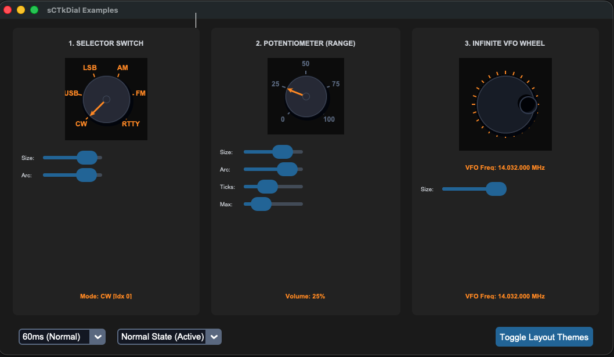

# sCustomTkinter Technical Components Reference - Part 1

This document contains the complete developer reference documentation for the specialized sCTk CustomTkinter layout toolkit. 

All modules are built natively using CustomTkinter vector elements, ensuring clean scaling across high-DPI panels, full dual-profile theme compliance (Light/Dark mode), and complete freedom from standard Tcl/Tk focus bugs on macOS. Unselectable file parameters are dynamically dimmed, disabled, and locked from mouse clicks in real time.

---

## Centralized Theme & Integrity Guard Lockout

All custom layout components inherit properties and configuration data from ThemeableWidget and pull values out of the shared style sheet registry THEME_DEFAULTS inside sCTkThemes.py.

### Core Safety Exception Interceptors
To protect your production scripts from CustomTkinter's strict initialization checks (such as dropping a ValueError: color is None or throwing a TypeError for unexpected dictionary arguments), the suite implements two severe global validation traps straight inside ThemeableWidget.py:
1. Critical File Guard: If sCTkThemes.py is entirely missing or cannot be imported at boot, the application halts immediately and outputs a detailed FileNotFoundError on the terminal.
2. Null-Traffic Interceptor: If a component section exists inside sCTkThemes.py but has empty placeholder properties (None), the application stops compiling and raises a clear ValueError specifying exactly which widget and key path is broken.
3. Contamination Filter: The mixin isolates the disabled_map tracking sub-dictionary into a private class property (self._widget_disabled_map), stripping it completely from self.final_kw. This guarantees that forwarding **self.final_kw straight into native CustomTkinter base class constructors never leaks tracking keys or crashes your screens.

---

## 1. sCTkPathChooser (Compound Input Row)

The sCTkPathChooser is an advanced entry-based path selection row designed for settings forms and configuration columns. It pairs a fluid layout text entry field with a square or wide descriptive browse button.

The text entry field acts like an accordion: it is assigned an initial layout width of 0 inside a column weighted to 1, meaning it automatically stretches or contracts to fill 100% of whatever horizontal space remains after the browse button claims its fixed btn_width. By using a single vector character character token (such as "▶" or ">") combined with a narrow btn_width=36, you maximize the screen real estate for nested file strings.

### Constructor Signature
```python
sCTkPathChooser(master=None, width=350, height=32, type="directory", justify="left", title="Select Path", initialdir=None, initialfile=None, filetypes=None, btn_width=110, btn_height=32, btn_text=None, entry_height=32, browser_width=500, browser_height=450, state="normal", command=None, **kwargs)
```

### Available Properties & Arguments

| Argument | Type | Default | Description |
| :--- | :--- | :--- | :--- |
| **width** | int | 350 | Total horizontal width in pixels of file entry and button combined. File path width = total width - button width. |
| **height** | int | 32 | Total vertical space allocated to the frame container block envelope. Children padding loops center them inside this space. |
| **type** | str | "directory" | Determines file picking or directory selection ("file" or "directory"). (Case-insensitive) |
| **justify** | str | "left" | Aligns path text orientation ("left", "right", "center"). Set to "right" to anchor long strings on the trailing directory folder names. |
| **btn_text** | str | None | Custom character text string mapped directly to the button face (e.g. "▶"). If left as None, it falls back to wide descriptive phrases like "Browse Folders...". |
| **entry_height** | int | 32 | Explicit thickness height in pixels assigned directly to the text entry field sub-widget. |
| **btn_width** | int | 110 | Explicit width in pixels assigned directly to the browse button element. |
| **btn_height** | int | 32 | Explicit thickness height in pixels assigned directly to the browse button element. |
| **browser_width** | int | 500 | Width of the pop-up modal file browser window in pixels. |
| **browser_height** | int | 450 | Height of the pop-up modal file browser window in pixels. |
| **state** | str | "normal" | Set whether row is interactive ("normal" or "disabled"). Toggling to disabled locks fields and dims colors using disabled_map. |

### Public API Methods
*   **set(path_string: str) -> None** – Rewrites the input box location string, executing system normalization rules automatically. Triggers your command callback.
*   **get() -> str** – Extracts the absolute normalized path string currently written inside the input field.
# sCustomTkinter Technical Components Reference - Part 2

---

## 2. Structural Passive Containers (sCTkFrame variants)

To follow native Tkinter conventions and avoid fragile timer overrides or initialization race conditions, all structural container classes behave as **passive geometry layout groups**. They do not actively monitor, police, or block incoming children on arrival. 

Toggling states on an entry group is handled cleanly at the application controller level using runtime children iterations (winfo_children()).

### sCTkFrame / sCTkFrameOutlined / sCTkScrollableFrame
Standard direct subclasses of native CustomTkinter frame elements wrapped in ThemeableWidget parameters. They pass arguments up to their parent layers cleanly.
```python
# Pure initialization layout pass
my_group = sCTkFrameOutlined(parent_window, border_width=2)
my_group.pack(fill="both", expand=True)
```

### sCTkFrameLabeledPrimary / sCTkFrameLabeledSecondary
Custom scrollable viewport containers that natively hide their vertical scrollbar paths by retrieving their active frame fg_color and painting the inner self._scrollbar parameters to match invisibly while setting track width to 0. 

They preserve complete compatibility with Pygubu Designer because they inherit directly from ctk.CTkScrollableFrame—allowing you to drag, drop, and pack elements inside them with native properties (label_text and label_anchor) working perfectly out of the box.
```python
# Native configurations compile fluidly inside Pygubu Designer trees
labeled_scroll_pane = sCTkFrameLabeledPrimary(
    master=app,
    label_text="System Network Configurations",
    label_anchor="w"
)
```

---

## 3. Visual Static Labels (sCTkLabel variants)

Because standard CustomTkinter CTkLabel components do not feature a native state property, running a generic form-disabling loop over a container normally leaves label descriptions fully bright, breaking your UI aesthetic.

The **sCTkLabelPrimary**, **sCTkLabelSecondary**, and **sCTkLabelTertiary** components natively intercept the .configure(state="...") property key. When set to "disabled", they gracefully intercept the command, bypass standard Tkinter attribute rejections, and look up the exact dimming colors assigned to the "text_color" row inside your style sheets to match your frozen fields.

### Global Controller Disabling Pattern
To cleanly freeze a passive container frame group and all of its interior fields and custom labels at runtime, apply this standard loop pattern inside your controller file:

```python
def set_form_group_state(container_widget, target_state: str):
    """Recursively walks down the layout group to toggle states on all input controls and labels."""
    for child in container_widget.winfo_children():
        if hasattr(child, "configure"):
            try:
                child.configure(state=target_state)
            except Exception:
                pass
```

---

## 4. Creating Standardized Dialogs With sCTkDialogCore

The creation of an advanced user dialogue panel is a structured, multi-step process in the sCustomTkinter system. This flow decouples structural layouts from operational code.

### Step-by-Step Implementation Workflow

#### Step 1: Initialization inside Pygubu-Designer
1. Open Pygubu-Designer and create a new clean project space (e.g., settingMachine).
2. Add a standard **CTkToplevel** widget into your visual workspace canvas.
3. Open the **Settings** panel, select the **Compound Subclass** choice option, and fill out your specific values for both the object name and your desired file package destination folder. 
4. *Note:* Leave the **Styles** option entirely blank. If custom components are missing from your layout pane options, register them via the **Custom Widget** setup tab first.
5. **Important:** Now, delete the placeholder CTkToplevel element you just generated from the design tree hierarchy.
6. Add the **sCTkDialogCore** custom component widget straight into your design workspace canvas (rename the instance label identifier token if desired).
7. Return to the visual **Settings** pane and assign your main layout widget reference target to lock onto the **sCTkDialogCore** element you just added.
8. Save your visual designer tree.

#### Step 2: Adding Content to the Dialog
1. With your active Pygubu-Designer project open, drag and direct additional custom sCTk input widgets directly onto the dialog canvas shell.
2. All inputs will align and organize themselves natively within the designated **Content Area**.
3. Customize your layout properties freely, setting row grid parameters, cell constraints, or pixel padding metrics (padx / pady).
4. Operational buttons, titles, and confirmation click handlers can be configured or swapped later via built-in convenience methods.
5. Save your work and select **Generate Code**.

#### Step 3: Customizing Generated Class Code
1. Open your top-level operational class file in your script editor space. Focus on **classname.py** (do NOT modify the structural baseline file classnameui.py).
2. Inject the following import declaration line at the absolute top of the module file structure:
   ```python
   from sCTkDialogMixin import sCTkDialogMixin
   ```
3. Inject the dialog mixin token straight into your class definition inheritance chain. Your original generated definition line will look like this:
   ```python
   class classname(baseui.classnameUI):
   ```
   Modify it to include the helper mixin parameter like this:
   ```python
   class classname(sCTkDialogMixin, baseui.classnameUI):
   ```

---

### Built-in Convenience Functions Reference

#### Dialogue & Window Management

*   **self.onDeleteWindow()**  
    Trigger hook bound to handle standard system Window Manager intercept close requests (e.g. clicking the top title bar "X" close circle).
*   **self.dialogClose()**  
    Call programmatically anywhere inside your controller script functions to instantly dismiss, unbind, and destroy the open dialog modal screen.
*   **self.runAndWait()**  
    Locks focus onto the window and forces the dialog into a strict **Modal (Blocking)** interaction state. The script will halt execution on that thread until the window closes. If this method is not explicitly called, the dialog window remains **Non-Modal (Fluid)**.
*   **self.setTitle(title: str)**  
    Dynamically rewrites the text string displayed at the top left of the native operating system window header shell wrapper.

#### Viewport & Button Content Management

*   **self.setHeading(heading=None, anchor=None)**  
    Modifies the core header label text printed above the content grid. The anchor string input accepts standard parameters: "w", "e", or "center". All alternative anchor inputs are ignored. Passing None to either argument results in no modification to that specific layout parameter.
*   **self.setTwoButton()**  
    Configures the window button row to display exactly two functional controls: an **Apply** action button and a **Cancel** shortcut button.
*   **self.setApplyButton(buttonName=None, ButtonCommand=None)**  
    Configures the label text string and click callback function pointer for the primary validation button. Passing None preserves current settings. Returns True.
*   **self.setCancelButton(buttonName=None, ButtonCommand=None)**  
    Configures the label text string and click callback function pointer for the exit shortcut button. Passing None preserves current settings. Returns True.
*   **self.setResetButton(buttonName=None, ButtonCommand=None)**  
    Configures the label text string and click callback function pointer for the secondary option button. Passing None preserves current settings. If the internal reset button component has been previously destroyed or unmapped, no updates occur and it returns False. Otherwise, parameters align and it returns True.

# sCTkSelector
#### Derived from Selector class by Fastattack, 2024.   Source Repository: [MoreCustomTkinterWidgets](https://github.com/fastattackv/MoreCustomTkinterWidgets)  
<br>
An advanced, thematic, multi-choice selection frame component derived from Fastattack's `Selector` utility framework. This component features responsive layout management, an instant alphanumeric search filter, strict element uniqueness constraint handling, and dark/light mode asset harmonization via `ThemeableWidget`.

## Class Signature

```python
class sCTkSelector(sCTkFrame, ThemeableWidget):
    def __init__(
        self, 
        master, 
        items: Optional[list[str]] = None, 
        multiple_choices: bool = True, 
        **kwargs
    ):
```

---

## Core Operational Parameters

| Attribute | Data Type | Default | Operational Profile Description |
| :--- | :--- | :--- | :--- |
| `items` | `list[str]` | `[]` | An array containing option strings. Elements must be unique to pass structural consistency layout parsing checks. |
| `multiple_choices` | `bool` | `True` | Toggles selection modes. When `False`, choosing a checkbox auto-clears all prior checklist options. |
| `state` | `str` | `"normal"` | Accepts `"normal"` or `"disabled"`. Switching to `"disabled"` blocks input to the search entry and grays out list items based on theme settings. |
| `pack_propagate` | `bool` | `True` | Layout configuration rule option. Set to `False` to prevent the container from collapsing around sub-elements. |
| `grid_propagate` | `bool` | `True` | Layout configuration rule option. Set to `False` to lock exact geometric size grid allocations. |

---

## Programmatic API Reference

### Primary API Methods

#### `.get_selections() -> list[str]`
Returns a list containing the text string names of all currently selected checklist entries.
* **Return Format:** `['vw', 'roadster']`

#### `.get_all_items() -> list[str]`
Returns an active lookup list of all items registered in the picker frame.
* **Return Format:** `['vw', 'porsche', 'roadster', 'tesla']`

#### `.clear_selections()`
Clears all active option checkmarks across the entire visibility tree, safely updating tracking variables.

#### `.configure(**kwargs)`
The master runtime routing pipeline. Safely typecasts layout entries from text fields, intercepting custom parameters before passing geometry attributes downward to CustomTkinter's base frame layout module.

---

### Internal Helper Methods

The following methods manage internal callback parsing loops, view transitions, and interface layout mutations. They are executed automatically by the widget framework, but can be invoked manually or extended to handle specialized interactions.

#### `._selection(index: int)`
The master selection controller logic. Fired automatically when a user toggles any checkmark option.
* **Functional Profile:** Manages list indices within `self.selected_indexes`. If `self.multiple_choices` evaluates to `False`, it iteratively sweeps all alternative widgets, triggering their `.deselect()` events to enforce a strict radio-button style selection state.

#### `._search_modified(*args)`
The instant-filter validation scanner callback. Monitored continuously via a write trace on `self.search_var`.
* **Functional Profile:** Automatically reads string strings inside the search entry bar. It loops through `self.checkboxes`, matching substrings using `.startswith()`. Matching choices are packed inside a grid list array via `.grid()`, while non-matching rows are cleanly stripped from layout rows via `.grid_forget()`. Calls `._reset_scroll()` instantly at completion.

#### `._reset_scroll()`
Resets scroll tracking bounds whenever filters adapt.
* **Functional Profile:** Directs the hidden nested canvas mapping engine of the scrollable frame wrapper container, using its internal y-axis view modifier function (`self.checkboxes_frame._parent_canvas.yview_moveto(0)`) to snap the view coordinates back to index `0` instantly.

---

## Pygubu-Designer Inspector Integration Layout

To display and modify parameters within Pygubu-Designer's visual editor panel without breaking code generation arrays, format your inspector parameters exactly as follows:

### 1. Visual Configuration Fields

* **`items` Field Format (Use Single Quotes Inside):**
  ```text
  ['apple', 'pear', 'orange', 'banana']
  ```
  *Note: Always use single quotes surrounding internal string strings within the entry field text box to ensure safe generation compilation without double quote nesting syntax issues.*

* **`multiple_choices` Dropdown Options:**
  * `True` *(Enables checklist multi-selection checks)*
  * `False` *(Enables radio-button style single selection mode)*

* **`state` Dropdown Options:**
  * `normal` *(Active element state operations color tracking)*
  * `disabled` *(Grayed out visual interface mode bounds)*

* **`pack_propagate` / `grid_propagate` Options:**
  * `True` *(Auto shrink-wraps to fit the child checklist elements)*
  * `False` *(Locks layout parameters explicitly to designated width/height rules)*

---

## Centralized Theme Mapping Rules (`sCTkThemes.py`)

To prevent the global framework corruption guards or null value traffic interceptors from triggering an application startup crash exception, format your `sCTkSelector` node within your theme asset dictionary file exactly as follows:

```python
THEME_DEFAULTS = {
    "sCTkSelector": {
        "fg_color": "transparent",
        "corner_radius": 6,
        
        # Centralized color settings for the disabled mode state block
        "disabled_map": {
            "text_color": ("#808080", "#666666"),  # Light Mode / Dark Mode text colors
            "fg_color": "transparent"
        },
        
        # Placeholder dictionary tags to satisfy strict initialization loop checks
        "pressed_map": {
            "state_placeholder": "none"
        },
        "alarm_map": {
            "state_placeholder": "none"
        }
    }
}
```

---

## Production Integration Example

```python
import customtkinter as ctk
from sCTkSelector import sCTkSelector

def fetch_data():
    # Retrieve current option list array selections
    active_picks = selector_widget.get_selections()
    print(f"Active dashboard criteria flags: {active_picks}")

root = ctk.CTk()
root.geometry("400x450")

# Instantiate layout component with propagation guards locked to sizing constraints
selector_widget = sCTkSelector(
    root, 
    items=["Radio Node A", "Radio Node B", "Radio Node C"],
    multiple_choices=False,
    width=350,
    height=200,
    pack_propagate=False
)
selector_widget.pack(expand=True, fill="both", padx=20, pady=20)

confirm_btn = ctk.CTkButton(root, text="Capture Selections", command=fetch_data)
confirm_btn.pack(pady=15)

root.mainloop()
```
# sCTkSeparator
#### Derived from Selector class by Fastattack, 2024.   Source Repository: [MoreCustomTkinterWidgets](https://github.com/fastattackv/MoreCustomTkinterWidgets)
<br>
The `sCTkSeparator` is an advanced, themeable divider widget for CustomTkinter that extends `ctk.CTkBaseClass` and implements multiple inheritance with `ThemeableWidget`. It provides dynamic scaling via layout managers, vector-drawn customizable corner radiuses, dashed/dotted line styles, and automated line-splitting centered section text headers with bounding capsule brackets.

---

## 🛠️ System Architecture Overview

The subsystem relies on a clean decoupling architecture distributed across two primary codebase assets:

1. **`sCTkSeparator.py`**: The core runtime component that manages canvas vectors, multiple-inheritance initialization tracking hooks, and order-independent orientation configurations.
2. **`sCTkSeparatorbo.py`**: The Pygubu Designer Builder Object module plugin that seamlessly integrates configuration fields into the visual editing canvas workspace without leaking or warping layout frame dimensions.

---

## 📋 API Property Reference

| Property Name | Data Type | Default Value | Description |
| :--- | :--- | :--- | :--- |
| `master` | `any` | *Required* | Parent container instance (e.g., `sCTkFrame` or `ctk.CTk`). |
| `length` | `int` | `100` | The total span length of the line track in pixels (corresponds to widget height if vertical, width if horizontal). |
| `width` | `float` | `4` | The visual thickness profile of the divider line in pixels. |
| `corner_radius` | `int` or `None` | `6` (from theme) | Defines roundness sharpness of divider line endpoints (defaults to stylesheet configuration). |
| `orientation` | `str` | `"vertical"` | Sets spatial directional positioning alignment. Accepts `"vertical"` or `"horizontal"`. |
| `text` | `str` | `""` | Appends a centered section header label text directly inside a computed line split zone. |
| `font` | `tuple` or `CTkFont` | `("Arial", 11, "bold")` | Text font profile style parameters for the embedded header tag. |
| `text_color` | `str` or `Tuple[str, str]` | Central theme default | Font hex palette token string mapping. Supports appearance mode tuples. |
| `dash` | `tuple` or `None` | `None` | Integer stroke sequence array tuple mapping out dashed/dotted rendering rules (e.g., `(5, 5)`). |

---

## 🎨 Centralized Stylesheet Setup (`sCTkThemes.py`)

To guarantee high-contrast translation states across light and dark system transitions without populating Pygubu with inline overrides, ensure your central configuration mapping dictionary contains the following node:

```python
THEME_DEFAULTS = {
    "sCTkSeparator": {
        "fg_color": ("#808080", "#8A9296"), # (Light Mode Mid-Grey, Dark Mode Silver-Slate)
        "bg_color": "transparent",
        "corner_radius": 6,
        "font": ("Arial", 11, "bold"),
        "text_color": ("#1A1A1A", "#FFFFFF")  # (Stark Charcoal, Pure White)
    },
    # ... your other widget entries
}
```

---

## 📐 Layout Manager Integration Requirements

Mixing layout manager tracking loops within the same immediate frame layer is completely blocked. When handling automated expansion parameters across scaling monitor resolutions, enforce the following geometry behaviors:

### Grid Configurations (`.grid()`)
* **Horizontal Mode Line**: Must use **`sticky="ew"`** to allow the vector path to grow horizontally.
* **Vertical Mode Line**: Must use **`sticky="ns"`** to stretch the line across rows.
* **Parent Frame Setup**: The container frame track columns/rows **must** have their weights configured to let the engine allocate expanding window real estate:
  ```python
  # Column 0 and Column 2 hold widgets and expand; Column 1 isolates the separator line track
  grid_Frame.grid_columnconfigure(0, weight=1)
  grid_Frame.grid_columnconfigure(1, weight=0)
  grid_Frame.grid_columnconfigure(2, weight=1)
  ```

### Pack Configurations (`.pack()`)
* **Horizontal Mode Line**: Must use **`fill="x"`** alongside `expand=False` so it hugs adjacent frames tightly instead of expanding into empty background rows.
* **Vertical Mode Line**: Must use **`fill="y"`** inside layout columns.

---

## 💻 Pygubu Designer Properties Guide

When configuring layouts visually within the Pygubu Designer editing workspace panel strip, observe these property formatting rules:

1. **`orientation`**: Select `vertical` or `horizontal` from the choice dropdown list pane. The preview canvas will immediately adjust orientations without flattening.
2. **`text`**: Type any section title banner sequence string directly into the entry field (e.g., `AUDIO CONTROLS`). The line will cleanly break around the text boundaries.
3. **`dash`**: Enter raw comma-separated lists of numerical values directly into the input strip **without using quote symbols or brackets**.
   * Type `5,5` for standard clean dash blocks.
   * Type `2,6` for clean dotted layout maps.
   * Leave blank or type `None` to restore solid rounded vector shapes.
4. **Dimensions with Headers**: When utilizing `text` headers on a `vertical` orientation alignment track line, remember to increase the designer **`width`** attribute setting from `4` to a larger size (e.g., `20` or `24`) to give the vertical top and bottom capsule framing lines physical canvas clearance to draw.

# sCTkMessage
#### Derived from Selector class by Fastattack, 2024.   Source Repository: [MoreCustomTkinterWidgets](https://github.com/fastattackv/MoreCustomTkinterWidgets)  
<br>

The `sCTkMessage` is an advanced, themeable dialog window system subclassed from `ctk.CTkToplevel` and integrated with `ThemeableWidget`. It replaces standard OS message alerts with modular, center-positioned dialogue boxes featuring dynamic text-wrapping, automated parent window tracking calculations, custom asset handling, and support for dual high-contrast action selection layouts that return boolean runtime parameters.

---

## 🛠️ System Architecture Overview

The subsystem operates dynamically at runtime through execution logic chains. Because modal dialog boxes are instantiated procedurally within code event callbacks rather than being statically placed, **this component does not require a Pygubu Builder Object (BO) file.**

The architecture is divided into the following layout segments:
1. **`sCTkMessage.py`**: Contains the top-level window manager tracking rules, uniform grid button size distributions, and global functional shortcut wrappers.
2. **`images/` Subdirectory**: A localized storage assets folder matching your component layout containing custom graphic files.
   * `info.png`, `warning.png`, `error.png` *(Standard Light Mode Assets)*
   * `info_dark.png`, `warning_dark.png`, `error_dark.png` *(High-Contrast Dark Mode Overrides)*

---

## 📋 API Constructor Reference

```python
sCTkMessage(title, message, typ, master=None, buttons="ok", ok_text="Ok", yes_text="Yes", no_text="No", width=400)
```

| Parameter Name | Data Type | Default Value | Description |
| :--- | :--- | :--- | :--- |
| `title` | `str` | *Required* | Text displayed inside the top operating window header bar title deck. |
| `message` | `str` | *Required* | Body text string message container paragraph to display inside the prompt panel. |
| `typ` | `str` | *Required* | Alert asset track type classification identifier. Accepts `"info"`, `"warning"`, or `"error"`. |
| `master` | `any` | `None` | Reference pointer tracking your root window or parent `sCTkFrame` to calculate centering bounds. |
| `buttons` | `str` | `"ok"` | Layout selection control mapping. Accepts `"ok"` (single center prompt) or `"yes_no"` (twin balanced selections). |
| `ok_text` | `str` | `"Ok"` | Custom display string label mapped to the single button layout option track. |
| `yes_text` | `str` | `"Yes"` | Display string assigned to the primary confirmation button choice track. |
| `no_text` | `str` | `"No"` | Display string assigned to the secondary dismissal button choice track. |
| `width` | `int` | `400` | Manual window width boundary tracking restriction limit measured in pixels. |

---

## ⚡ Global Shortcut Function Handlers

To launch modal dialog blocks quickly inside callback triggers without handling complete class instantiations manually, utilize these pre-wired functional shortcuts:

### Standard Alert Prompts (Returns `True` upon closure)
```python
showinfo(title, message, ok_text="Ok", width=400, master=root)
showwarning(title, message, ok_text="Ok", width=400, master=root)
showerror(title, message, ok_text="Ok", width=400, master=root)
```

### Confirmation Prompt Shortcuts (Returns primitive Python `True` or `False` boolean states)
```python
askyesno(title, message, yes_text="Yes", no_text="No", width=400, master=root)
askwarningyesno(title, message, yes_text="Yes", no_text="No", width=400, master=root)
askerroryesno(title, message, yes_text="Yes", no_text="No", width=400, master=root)
```

---

## 🎨 Centralized Stylesheet Integration (`sCTkThemes.py`)

The component relies heavily on your centralized style dictionary system. To prevent the mixin parser tracking structures from raising runtime validation faults, verify your shared stylesheet contains this asset entry:

```python
THEME_DEFAULTS = {
    "sCTkMessage": {
        "font": ("Arial", 14),
        "text_color": ("#1A1A1A", "#E5E5E5") # (Stark Charcoal, Soft Off-White)
    },
    # ... your other widget entries
}
```

---

## 📐 Layout & Text Wrapping Integration Rules

To completely bypass CustomTkinter's internal multi-line font calculation limitations, this widget uses Python's native `textwrap` module to inject hard newline coordinates before passing layout parameters to your primary text components.

Observe these implementation traits:
* **Horizontal Capsule Brackets**: When `buttons="yes_no"` is active, Column 0 and Column 1 utilize an interlocking `uniform="dialog_buttons"` constraint map. This completely locks both buttons to an identical layout grid pixel width, regardless of text length mismatches.
* **Vertical Safety Gutter**: Text layout nodes use `padx=(10, 35)` paired alongside a calculated character width subtraction map. This forces word bounds to drop downwards well before interacting with the physical window frame margin boundary.
* **Autonomous Resizing**: The `_center_window` geometry calculations lock your custom manual `width` pixel profile constraint, but query the active required widget layout height parameters dynamically via `winfo_reqheight()`. This allows window frames to expand or shrink vertically based on your text content volume requirements automatically.

# 📊 sCTkTableView Widget Component Reference Guide

The `sCTkTableView` is an advanced, high-performance, 100% themeable custom spreadsheet matrix widget engineered specifically for the `sCustomTkinter` desktop suite. Subclassed directly from `sCTkScrollableFrame`, it maps a 2D data matrix grid layout using theme-synchronized `sCTkLabelPrimary` elements for column category headings and `sCTkLabelSecondary` elements for text data lines.

---

## ✨ Key Features & Enhancements
* **Autonomous Viewport Self-Sizing**: Automatically calculates absolute pixel bounding dimensions on dataset load to eliminate right-side gaps and bottom padding artifacts.
* **Capsule Frame Outline Wrapping**: Packs cells snugly within a dedicated inner frame structure (`table_outline_frame`) supporting adjustable corner radii and distinct boundary widths.
* **Typographic Gutter Margin Padding**: Injects internal text indentation spaces automatically on Left (`"w"`) and Right (`"e"`) alignments to prevent text strings from crowding cell borders.
* **Per-Column Data Validation Interceptors**: Hooks data validator routines downstream to screen string entry values *before* allowing writes to database memory matrices.
* **Unified Component State Cascading**: Supports full `.configure(state="disabled")` parameters passes, recursively locking cell interactivity while updating fonts to match stylesheet disabled gray color maps.

---

## 🛠️ Public Constructor API Signatures

```python
table = sCTkTableView(
    master,
    columns=["Col 1", "Col 2", "Col 3"],
    grid_mode="zebra",
    header_line_width=3,
    outline_width=1.5,
    outline_radius=6,
    state="normal"
)
```

### 📋 Parameter Property Profiles

| Argument Parameter | Type Mapping Profile | Default Assignment | Structural Layout Property Role |
| :--- | :--- | :--- | :--- |
| `master` | `any` | *Mandatory* | Parent Tkinter window container canvas frame. |
| `columns` | `List[str]` | *Mandatory* | Structured collection list containing top heading title names. |
| `grid_mode` | `Literal["zebra", "grid", "none"]` | `"zebra"` | Toggles alternating rows background coloring rules or solid box grid border panels. |
| `header_line_width` | `int` | `2` | Configures pixel thickness for the structural separator line beneath headers. |
| `outline_width` | `float` | `1.0` | Sets line thickness for the custom capsule border framing outline. |
| `outline_radius` | `int` | `4` | Determines corner rounding option parameters for the inner layout frame chassis. |
| `state` | `Literal["normal", "disabled"]` | `"normal"` | Dictates starting interactivity constraints and global text color palettes. |

---

## 📈 Public Interface Methods Reference

### `set_column_properties(column_index, width, anchor="center")`
Configures explicit horizontal constraints and text alignment rules for individual grid columns.
* **`column_index`** (`int`): Target lane layout tracker position index.
* **`width`** (`int`): Mandatory pixel limitation width for the cell widgets lane block.
* **`anchor`** (`Literal["w", "center", "e"]`): Structural layout font positioning tracker.

### `load_dataset(dataset)`
Clears previous widget references out of active memory arrays, maps new text data records line-by-line, and forces dynamic view sizing metrics.
* **`dataset`** (`List[List[Any]]`): The 2D matrix collection rows to parse down inside grid coordinates.

### `get_row_data(row_index)`
Queries the underlying active memory matrix to fetch the current values array of a row slot.
* **`row_index`** (`int`): Target row position. Returns `List[Any]` or `None`.

### `get_total_matrix_data()`
Returns the entire underlying spreadsheet dataset memory matrix layer unhindered.
* **Returns**: `List[List[Any]]`

### `configure(**kwargs)`
Alters component properties dynamically at runtime. Natively processes `state` transitions to lock interaction lanes and switch text gray maps.
* **Usage**: `table.configure(state="disabled")`

---

## 🔄 System Callbacks Functional Hooks

### `bind_selection_callback(callback)`
Registers a functional rule routine to trigger instantly whenever a user performs a standard left mouse single-click event over any row cell lane.
* **Callback Signature Expectation**: `def on_clicked(row_index: int, row_values: List[Any]) -> None`

### `bind_edit_callback(callback)`
Registers a data persistence tracker callback that fires automatically after an inline double-click cell text entry editing phase concludes successfully.
* **Callback Signature Expectation**: `def on_saved(row_index: int, col_index: int, saved_value: Any) -> None`

### `bind_validation_callback(callback)`
Hooks a validation checker onto the text editor loop. The rule function **must return a boolean validation state flag** (`True` to write changes or `False` to abort and restore original data values).
* **Callback Signature Expectation**: `def check_rules(col_index: int, fresh_input_string: str) -> bool`

---

## 🎨 Centralized Themes Mapping Definition Sheets (`sCTkThemes.py`)

Add this exact configuration block definition within your global style registry dictionary to drive lookups:

```python
THEME_DEFAULTS["sCTkTableView"] = {
    # Main backing frame canvas backdrop
    "bg_color": "transparent",
    
    # Primary top headers bar styling profile properties
    "header_bg_color": ("#E2E8F0", "#1E293B"),
    "header_text_color": ("#0F172A", "#F8FAFC"),
    "header_font": ("Arial", 14, "bold"),
    
    # Secondary data cells grid lanes styling parameters
    "cell_bg_color": ("#FFFFFF", "#111827"),
    "cell_alt_bg_color": ("#F1F5F9", "#1D2433"),
    "cell_text_color": ("#1E293B", "#E2E8F0"),
    "cell_font": ("Arial", 13, "normal"),
    
    # Framework line separation markers and capsule borders configurations
    "grid_line_color": ("#CBD5E1", "#334155")
}
```

# sCTkTableview Component Documentation

The `sCTkTableview` is a high-performance, theme-adaptive, and interactive data grid widget engineered specifically for the `sCustomTkinter` desktop amateur radio workspace architecture. It wraps a specialized scrollable container viewport to render structured, matrix-aligned logging rows, transceiver channels, or telemetry tracking data.

---

## 📐 Core Architecture & Environment Sync Rules

To operate seamlessly across both visual design suites and standalone Python initialization runners, the table implements a **Dual-Environment Priority Pass** constraint layout:

1. **Design Mode (`num_columns` Rules):** Within the Pygubu Designer layout studio pane, the explicit numeric sidebar options act as the source of truth. If you type more label names than `num_columns` dictates, the text is sliced down to prevent visual canvas breaking. If you type fewer labels, the trailing empty layout slots are preserved as blank spacer columns.
2. **Runtime Mode (`columns` Rules):** When executed natively in production code, the length of the list passed into the `columns=[...]` initializer constructor takes absolute authority, overriding any defaults to stretch or shrink the matrix widths dynamically.
3. **Alphabetical Optimization:** Pygubu Designer forcefully serializes configuration dictionary payloads alphabetically (causing `columns` to execute before `num_rows`). `sCTkTableview` utilizes an internal **Redraw Loop Debounce Gate** to capture all incoming parameters silently first, executing a single ordered draw pass right at the tail end to prevent layout collapse.

---

## 🛠️ Developer API Reference

### Constructor Signature

```python
table = sCTkTableview(
    master,
    columns=None,
    width=500,
    height=300,
    grid_mode="zebra",
    header_line_width=2,
    outline_width=1.0,
    outline_radius=4,
    state="normal",
    num_columns=3,
    num_rows=1,
    show_headers=True,
    cell_bg_color=None,
    cell_alt_bg_color=None,
    *args,
    **kwargs
)
```

### Public Methods

#### `load_dataset(dataset: List[List[Any]])`
Loads a 2D Python array into the active grid interface matrix canvas. 
* **Row Overflow:** If the number of incoming data rows exceeds the configured `num_rows`, the table dynamically stretches downward, scaling the scroll frame automatically.
* **Row Underflow:** If incoming data records are fewer than `num_rows`, the widget populates the cells and leaves the remaining rows blank (preserving layout proportions).

#### `get_num_rows() -> int`
Returns the true number of physical rows currently gridded on screen. This metric dynamically includes empty fallback slots and blank padding arrays.

#### `get_num_columns() -> int`
Returns the total number of structural columns currently managed inside the table, accurately counting un-labeled spacer cells.

#### `set_column_properties(column_index: int, width: int, anchor: Literal["w", "center", "e"] = "center")`
Adjusts the geometry constraints and text justification for a specific column index. Anchor tags smoothly recalculate text cell margins with tracking margin buffers.

#### `bind_selection_callback(callback: Callable[[int, List[Any]], None])`
Binds a mouse click tracking hook (`<Button-1>`) to all cell slots. Triggers the callback with the targeted row index and its matching data row list array.

#### `bind_edit_callback(callback: Callable[[int, int, str], None])`
Binds an operation interceptor hook triggered whenever an operator double-clicks a cell slot, modifies the inline `CTkEntry` field overlay, and commits changes via `<Return>` or focus loss.

#### `bind_validation_callback(callback: Callable[[int, str], bool] -> bool)`
Mounts a pre-save check gating hook before inline edits are saved to the core cell structure. Returning `False` rejects the user string and restores the original data cell text.

---

## 🎨 Visual Configuration & Style Sheet Tokens

`sCTkTableview` extracts default styling parameters directly from your centralized `THEME_DEFAULTS` dictionary, using the structural keyword token map `"sCTkTableview"`. It handles appearance changes natively, switching between dark and light modes cleanly.

| Property Keyword | Data Type | Permitted Values | Functional Output Behavior |
| :--- | :--- | :--- | :--- |
| `grid_mode` | `str` | `"grid"`, `"zebra"`, `"none"` | Changes row backgrounds. `"none"` collapses all padding to `0` for borderless flat screens. |
| `show_headers` | `bool` | `True`, `False` | Toggles the visibility of the primary header text labels. |
| `header_line_width` | `int` | `0` to `10` pixels | Size of the line divider under headers. Setting it to `0` joins rows seamlessly. |
| `state` | `str` | `"normal"`, `"disabled"` | Controls editing; `"disabled"` locks rows out from double-click cell edits. |
| `outline_width` | `float` | `0.0` to `5.0` pixels | Border line size bounding the frame layout. |
| `outline_radius` | `int` | `0` to `20` pixels | Corner roundness bounding the frame layout. |
| `cell_bg_color` | `str` / `tuple` | Color String / Hex Tuple | Primary row cell backing color override block. |
| `cell_alt_bg_color`| `str` / `tuple` | Color String / Hex Tuple | Alternating row color used to draw striping in `"zebra"` mode. |

---

## 🗃️ Complete Edge-Case Integration Sample

```python
import customtkinter as ctk
from sCTkTableview import sCTkTableview

app = ctk.CTk()
app.geometry("600x400")

# Setup 5 columns x 8 rows baseline
table = sCTkTableview(
    master=app,
    num_columns=5,
    num_rows=8,
    columns=["Callsign", "Frequency", "Mode", "Power", "Grid"],
    grid_mode="zebra"
)
table.pack(padx=20, pady=20, fill="both", expand=True)

# 🚀 Robust Overflow/Underflow Handling Sample Data Payload
# Row 3 underflows column settings (padded with blanks)
# Row 4 overflows column settings (safely truncated)
logging_payload = [
    ["W6EL", "14.074 MHz", "FT8", "50W", "DM14"],
    ["K6K7", "7.047 MHz", "CW", "100W", "CM87"],
    ["N6RE", "21.285 MHz"], 
    ["AI6IR", "144.200 MHz", "FM", "25W", "DM12", "EXTRA_FIELD_IGNORED"]
]

table.load_dataset(logging_payload)

# Execution Hook Callbacks Linkages
table.bind_selection_callback(lambda r, data: print(f"Selected Row {r}: {data}"))
table.bind_edit_callback(lambda r, c, val: print(f"Cell modified at ({r},{c}) -> New Value: {val}"))
table.bind_validation_callback(lambda c, val: len(val.strip()) > 0) # Reject empty updates

app.mainloop()
```

# sCTkSMeter Component Documentation

The `sCTkSMeter` is a classical analog S-Meter/Output for a Ham Radio Transceiver. Like all sCTk widgets, it is theme-adaptive.

---

## 📋 API Constructor Reference

```python
sCTkSMeter(master=None, sig_min_value=0, sig_max_value=15, width=340, height=130, **kw)
```

| Parameter Name | Data Type | Default Value | Description |
| :--- | :--- | :--- | :--- |
| `master` | `any` | `None` | Reference pointer tracking your root window or parent `sCTkFrame` container layout layer. |
| `sig_min_value` | `int` / `float` | `0` | The raw input number mapping to the absolute left floor (**S0**) of the upper `SIGNAL` arc track. |
| `sig_max_value` | `int` / `float` | `15` | The raw input number mapping to the absolute right ceiling (**+60dB**) of the upper `SIGNAL` arc track. |
| `width` | `int` | `340` | Manual hardware panel horizontal width boundary tracking profile measured in pixels. |
| `height` | `int` | `130` | Manual hardware panel vertical height boundary tracking profile measured in pixels. |

---

## ⚡ Global Object Instance Methods

To drive the meter pointer sweep dynamics smoothly inside background tracking threads, frequency scanning routines, or telemetry stream updates, utilize this core value setter:

### Update Instrument Needle Value
```python
# Updates pointer positioning (Expects numeric ranges between sig_min_value and sig_max_value)
smeter.set(value)
```

* **Note:** Values dropping below `sig_min_value` or crossing past `sig_max_value` will automatically be clamped tightly to the track minimum/maximum thresholds to safeguard the visual rendering matrix from canvas clipping errors.

---

## 🎨 Centralized Stylesheet Integration (`sCTkThemes.py`)

The component relies heavily on your centralized style dictionary system. To prevent the mixin parser tracking structures from raising runtime validation faults during initialization cycles, verify your shared stylesheet contains this asset configuration block:

```python
THEME_DEFAULTS = {
    "sCTkSMeter": {
        # Light Mode: Clean White Face | Dark Mode: Deep Obsidian Cockpit Black
        "fg_color": ("#FFFFFF", "#0A0A0A"),       
        
        # High-Contrast Brand Blue for bright rooms / Illuminated Glowing Neon Amber for dark setups
        "text_color": ("#1A4375", "#FF9100"),     
        
        # Solid High-Contrast Crimson / Intense Mechanical Redline alert arc warning zone
        "alarm_color": ("#990000", "#FF2200"),    
        
        # Deep Cobalt-Navy Slate indicator pointer / Blazing Orange needle tracking sweep
        "needle_color": ("#112A4B", "#FF9100")    
    },
    # ... your other widget entries
}
```

# sCTkBarSMeter Component Documentation

The `sCTkBarSMeter` is a standalone, low-profile horizontal discrete LED segment bar widget displaying simultaneous, independent tracks for incoming S-Units, transmitter SWR ratio levels, and forward RF Power output percentage. Like all sCTk widgets, it is theme-adaptive.

---

## 📋 API Constructor Reference

```python
sCTkBarSMeter(master=None, sig_min_value=0, sig_max_value=15, swr_max_value=5.0, swr_visible=True, pwr_visible=True, hide_lower_row=False, width=340, height=110, **kw)
```

| Parameter Name | Data Type | Default Value | Description |
| :--- | :--- | :--- | :--- |
| `master` | `any` | `None` | Reference pointer tracking your root window or parent `sCTkFrame` container layout layer. |
| `sig_min_value` | `int` / `float` | `0` | The raw input number mapping to the absolute left floor (**S0**) of the upper `SIG` (Signal Strength) track. |
| `sig_max_value` | `int` / `float` | `15` | The raw input number mapping to the absolute right ceiling (**+60dB**) of the upper `SIG` (Signal Strength) track. |
| `swr_max_value` | `int` / `float` | `5.0` | The explicit maximum scale boundary representing the far right edge limit tracking your transmitter's SWR track. |
| `swr_visible` | `bool` | `True` | Visibility flag for the SWR cluster. Flipping to `False` shifts the text, ticks, and active LEDs into a faded, disabled palette look. |
| `pwr_visible` | `bool` | `True` | Visibility flag for the PWR cluster. Flipping to `False` shifts the text, ticks, and active LEDs into a faded, disabled palette look. |
| `hide_lower_row` | `bool` | `False` | Layout override command. When `True`, the entire lower instrumentation cluster collapses and vanishes, pushing the `SIG` bar to the true vertical center of the card footprint. |
| `width` | `int` | `340` | Manual hardware panel horizontal width boundary tracking profile measured in pixels. |
| `height` | `int` | `110` | Manual hardware panel vertical height boundary tracking profile measured in pixels. |

---

## ⚡ Global Object Instance Methods

### Update Instrument Telemetry Channels
```python
# Pass parameters to update any of the 3 telemetry rows independently on the fly
led_bar_gauge.set(s_value=9.2, swr_value=1.4, pwr_value=45.0)
```

### Live Layout Configuration Modifier
```python
# Updates layout presentation properties on the fly without reconstruction overhead
led_bar_gauge.configure_visibility(swr_visible=False, pwr_visible=True, hide_lower_row=False)
```

---

## 🎨 Centralized Stylesheet Integration (`sCTkThemes.py`)

The component relies heavily on your centralized style dictionary system. To prevent the mixin parser tracking structures from raising runtime validation faults, verify your shared stylesheet contains this asset configuration block:

```python
THEME_DEFAULTS = {
    "sCTkBarSMeter": {
        # Light Mode: Clean White Face | Dark Mode: Deep Obsidian Cockpit Black
        "fg_color": ("#FFFFFF", "#0A0A0A"),       
        
        # High-Contrast Brand Blue for bright rooms / Illuminated Glowing Neon Amber for dark setups
        "text_color": ("#1A4375", "#FF9100"),     
        
        # Solid High-Contrast Crimson / Intense Mechanical Redline alert segment zones
        "alarm_color": ("#DC2626", "#FF2200"),    
        
        # Active illuminated LED block color tracks mapped out below threshold limits
        "led_on_color": ("#2471A3", "#FF9100"),   
        
        # Unlit background matrix segment pockets visible behind dark/inactive areas
        "led_off_color": ("#E2E8F0", "#1A1D20")   
    },
    # ... your other widget entries
}
```
# `sCTkDial` — Rotary Dial Suite

The `sCTkDial` suite provides a premium group of theme-adaptive, object-oriented mechanical rotary tuning widgets engineered explicitly for ham radio desktop console interfaces. Derived from an abstract base core (`sCTkDialBase`), each distinct child class utilizes specialized vector graphics rendering paths and distinct input damping to mimic authentic radio console hardware while translating telemetry arrays into strict, application-friendly integers.

---

## 📸 Interface Preview



---

## 🎛️ Key Architectural Features

* **macOS Magic Mouse Native Fix:** Intercepts modern Aqua-Tkinter high-precision `TouchpadScroll` events and decodes compressed 32-bit binary data arrays. This completely unblocks smooth scrolling on Apple Silicon/Intel hardware without global `bind_all` interference.
* **Cross-Platform Delivery Loop:** Coexists seamlessly with traditional Windows integer multiples of 120 and Linux X11 discrete button-4/button-5 notch server packets.
* **Semantic Polymorphic Modeling:** Dynamically alters layout shapes based on class types—rendering sharp raised mechanical switch pointer lines for Selectors and Ranged pots, or infinite heavy flywheel faces with multi-layered 3D reversed-gradient finger scoops for VFO continuous wheels.
* **Zero-Subdivision Selection Masking:** Eliminates intermediate tick marks and knurling bleeding artifacts on Selector and Range panels, leaving an authentic, smooth matte face plate with markings drawn exclusively at operational steps.
* **Unified State Machine:** Supports native standard `.configure(state="disabled")` and `.cget("state")` controllers. When locked, it automatically maps the active face elements to an inactive palette and rejects cursor momentum tracking.

---

## 🎛️ 1. Discrete Mode Switch Selector (`sCTkDialSelector`)

Designed to mimic a physical multi-position rotary band or mode selection switch. It restricts pointer operations to fixed angular arcs, strips out all distracting intermediate tick subdivisions, and loops infinitely past boundary edges.

### Constructor
```python
sCTkDialSelector(master=None, labels=None, arc_angle=270, command=None, diameter=120, width=120, height=120, **kw)
```

### Parameter Reference Matrix

| Parameter Name | Data Type | Default Value | Description |
| :--- | :--- | :--- | :--- |
| `master` | `Widget` | `None` | Reference pointer tracking the parent parent `sCTkFrame` or root context window layout layer. |
| `labels` | `List[str / int]` | `["POS 1", "POS 2", "POS 3"]` | Explicit array of text choice options to map uniformly around the configured arc sweep. |
| `arc_angle` | `int / float` | `270` | Total active angular sweep area in degrees, automatically centered symmetrically at the top. |
| `command` | `callable` | `None` | **Primary Event Callback:** Fired instantly on rotation. Passes a strict, positive 0-based index integer matching the position in your labels list array. |
| `left_click_callback` | `callable` | `None` | Custom macro callback triggered on canvas Left Mouse Button clicks (e.g., handles accelerated jumps like `-2`). |
| `right_click_callback` | `callable` | `None` | Custom macro callback triggered on canvas Right Mouse Button clicks (e.g., handles accelerated jumps like `+2`). |
| `diameter` | `int` | `120` | **Geometric Sizing Constraint:** If specified, forces a strict 1:1 square canvas container, overriding structural box parameters to guarantee a perfect circle. |
| `width` | `int` | `120` | The explicit fallback horizontal pixel boundary box width for the widget container frame. |
| `height` | `int` | `120` | The explicit fallback vertical pixel boundary box height for the widget container frame. |
| `state` | `str` | `"normal"` | Set to `"normal"` for interactive tuning or `"disabled"` to freeze inputs and gray-out graphics. |

### Callback Signature & Usage
```python
# Emits strict 0-based item index integers
def on_mode_switch_rotated(active_index: int):
    operating_modes = ["CW", "USB", "LSB", "AM", "FM", "RTTY"]
    mode_string = operating_modes[active_index]
    print(f"Swapped transceiver mode to: {mode_string} (Index: {active_index})")
```

### Dynamic Property Modifiers Live
```python
# Change the list options and arc sweep on the fly
dial_selector.configure(labels=["160M", "80M", "40M", "20M", "10M"], arc_angle=240)

# Manually snap the switch pointer directly to index notch 2
dial_selector.set(2)
```

---

## 🎛️ 2. Hard End-Stop Potentiometer (`sCTkDialRange`)

Designed for continuous absolute attenuations like Volume, Mic Gain, or RF Attenuation. It enforces hard structural end-stops (blocks wrap-around) and decouples physical graduation markings from internal tracking values.

### Constructor
```python
sCTkDialRange(master=None, from_=0, to=100, arc_angle=270, command=None, diameter=120, width=120, height=120, divisions=5, **kw)
```

### Parameter Reference Matrix

| Parameter Name | Data Type | Default Value | Description |
| :--- | :--- | :--- | :--- |
| `master` | `Widget` | `None` | Reference pointer tracking the parent parent `sCTkFrame` or root context window layout layer. |
| `from_` | `int` | `0` | The lower absolute mathematical limit boundary offset initializing the rotation origin baseline. |
| `to` | `int` | `100` | The upper absolute mathematical limit boundary offset representing the maximum end-stop value. |
| `divisions` | `int` | `5` | The physical number of graduation calibration tick marks drawn uniformly around the dial perimeter. |
| `arc_angle` | `int / float` | `270` | Total active angular sweep area in degrees, automatically centered symmetrically at the top. |
| `command` | `callable` | `None` | **Primary Event Callback:** Fired instantly on rotation. Passes the current absolute position integer clamped between `from_` and `to`. |
| `left_click_callback` | `callable` | `None` | Custom macro callback triggered on canvas Left Mouse Button clicks (e.g., handles accelerated jumps like `-2`). |
| `right_click_callback` | `callable` | `None` | Custom macro callback triggered on canvas Right Mouse Button clicks (e.g., handles accelerated jumps like `+2`). |
| `diameter` | `int` | `120` | **Geometric Sizing Constraint:** If specified, forces a strict 1:1 square canvas container, overriding structural box parameters to guarantee a perfect circle. |
| `width` | `int` | `120` | The explicit fallback horizontal pixel boundary box width for the widget container frame. |
| `height` | `int` | `120` | The explicit fallback vertical pixel boundary box height for the widget container frame. |
| `state` | `str` | `"normal"` | Set to `"normal"` for interactive tuning or `"disabled"` to freeze inputs and gray-out graphics. |

### Callback Signature & Usage
```python
# Emits absolute tracking value integers
def on_volume_pot_rotated(absolute_value: int):
    # Wheel impulses step by 5 units automatically to keep the potentiometer fast and snappy
    print(f"Transceiver Audio Gain updated to: {absolute_value}%")
```

### Dynamic Property Modifiers Live
```python
# Re-calibrate a volume pot into a coarse squelch attenuator with 2 ticks
dial_range.configure(from_=0, to=10, divisions=2)

# Manually force the potentiometer value to absolute index 50
dial_range.set(50)

---

## 🎛️ 3. Infinite Flywheel Tuning Wheel (`sCTkDialContinuous`)

Designed exclusively for Variable Frequency Oscillators and rapid continuous menu rolling. It spins infinitely in 360-degree vectors, ignoring absolute limit boundaries completely.

### Constructor
```python
sCTkDialContinuous(master=None, divisions=24, command=None, left_click_callback=None, right_click_callback=None, diameter=120, width=120, height=120, **kw)
```

### Parameter Reference Matrix

| Parameter Name | Data Type | Default Value | Description |
| :--- | :--- | :--- | :--- |
| `master` | `Widget` | `None` | Reference pointer tracking the parent parent `sCTkFrame` or root context window layout layer. |
| `divisions` | `int` | `24` | Number of detented layout index points tracked inside a single 360° visual turn of the dimple indicator. |
| `command` | `callable` | `None` | **Primary Event Callback:** Fired instantly on rotation. Passes a signed step velocity delta integer (`+1` for CW, `-1` for CCW). |
| `left_click_callback` | `callable` | `None` | Custom macro callback triggered on canvas Left Mouse Button clicks (e.g., handles accelerated jumps like `-2`). |
| `right_click_callback` | `callable` | `None` | Custom macro callback triggered on canvas Right Mouse Button clicks (e.g., handles accelerated jumps like `+2`). |
| `diameter` | `int` | `120` | **Geometric Sizing Constraint:** If specified, forces a strict 1:1 square canvas container, overriding structural box parameters to guarantee a perfect circle. |
| `width` | `int` | `120` | The explicit fallback horizontal pixel boundary box width for the widget container frame. |
| `height` | `int` | `120` | The explicit fallback vertical pixel boundary box height for the widget container frame. |
| `state` | `str` | `"normal"` | Set to `"normal"` for interactive tuning or `"disabled"` to freeze inputs and gray-out graphics. |

### Callback Signature & Usage
```python
# Emits signed directional step velocity deltas (+1, -1, +2, -2)
def on_vfo_wheel_rotated(signed_step_delta: int):
    global current_frequency_hz
    # Multiply raw step increments by a simulated 100 Hz tuning channel step
    current_frequency_hz += signed_step_delta * 100
    refresh_frequency_display()
```

### Dynamic Property Modifiers Live
```python
# Dynamically re-scale the heavy VFO flywheel container box size instantly at runtime
tuning_dial.configure(diameter=140)

# Manually advance the 3D visual dimple layout coordinates by an integer tracking step delta
tuning_dial.set_position_index(1)
```

---

## 🎨 Centralized Stylesheet Integration (`sCTkThemes.py`)

The suite fully complies with standard design systems and loads its parameters dynamically from your central dictionary theme registry based on active child class names. Make sure your shared configuration entries contain these exact tokens to maintain layout unity:

```python
THEME_DEFAULTS = {
    "sCTkDial": {
        "fg_color": ("#F1F5F9", "#0A0A0A"),       
        "text_color": ("#1A4375", "#FF9100"),     
        "dial_color": ("#9E9E9E", "#2A2F3D"),     
        "shadow_color": ("#CBD5E1", "#02040A"),
        "disabled_text_color": ("#94A3B8", "#4B5563"),
        "disabled_dial_color": ("#E2E8F0", "#1A1D24"),
        "disabled_dimple_glow": ("#CBD5E1", "#334155")
    },
    "sCTkDialSelector": {
        "fg_color": ("#F1F5F9", "#0A0A0A"),       
        "text_color": ("#1A4375", "#FF9100"),     
        "dial_color": ("#9E9E9E", "#2A2F3D"),     
        "shadow_color": ("#CBD5E1", "#02040A"),
        "pointer_color": ("#1A4375", "#FF9100"),   
        "disabled_text_color": ("#94A3B8", "#4B5563"),
        "disabled_dial_color": ("#E2E8F0", "#1A1D24")
    },
    "sCTkDialRange": {
        "fg_color": ("#F1F5F9", "#0A0A0A"),       
        "text_color": ("#1A4375", "#64748B"),     
        "dial_color": ("#9E9E9E", "#2A2F3D"),     
        "shadow_color": ("#CBD5E1", "#02040A"),
        "pointer_color": ("#1A4375", "#FF9100"),   
        "disabled_text_color": ("#94A3B8", "#4B5563"),
        "disabled_dial_color": ("#E2E8F0", "#1A1D24")
    },
    "sCTkDialContinuous": {
        "fg_color": ("#F1F5F9", "#0A0A0A"),       
        "text_color": ("#1A4375", "#FF9100"),     
        "dial_color": ("#1E293B", "#181E2B"),     
        "shadow_color": ("#CBD5E1", "#02040A"),
        "pointer_glow_color": ("#CBD5E1", "#3A455C"), 
        "disabled_text_color": ("#94A3B8", "#4B5563"),
        "disabled_dial_color": ("#E2E8F0", "#1A1D24"),
        "disabled_dimple_glow": ("#CBD5E1", "#334155")
    }
}
```


# sCTkSpinbox — Advanced Numerical Entry Component

The `sCTkSpinbox` is a premium, theme-adaptive numerical spinbox component that fully replicates traditional `ttk.Spinbox` behaviors. It stacks vertical adjustment arrows on the side and natively embeds your design system's `sCTkEntryPrimary` module. This ensures absolute typography continuity, proper border weights, and seamless, automatic light/dark theme adaptations across your panel grid layouts.

---

## 🎛️ Key Architectural Features

* **Strict sCTkEntryPrimary Inheritance:** By wrapping your custom entry element instead of a raw `ctk.CTkEntry`, it instantly grabs your specific font weights, outline rings, and precise background fill states.
* **Full Ttk Feature Mapping:** Replicates the core parameter ecosystem of `ttk.Spinbox`, adding direct pass-through support for text justification variables, password character masking, and explicit Tkinter tracking variables.
* **Cascading State Machine:** Toggling `.configure(state="disabled")` cleanly drops sub-component text colors, border highlights, and micro-arrow vectors down to your muted disabled stylesheet tokens.
* **Automatic Input Validation:** Automatically sanitizes and hard-clamps human typing entries within your defined boundary limits upon `FocusOut` or `<Return>` keystrokes, completely isolating the core radio VFO buffer from corrupted string data.

---

## 📋 API Constructor Reference

```python
sCTkSpinbox(master=None, from_=0.0, to=100.0, step_size=1.0, command=None, state="normal", wrap=False, justify="left", show=None, textvariable=None, placeholder_text=None, exportselection=True, width=140, height=32, **kw)
```

### Parameters Matrix

| Parameter Name | Data Type | Default Value | Description |
| :--- | :--- | :--- | :--- |
| `master` | `Widget` | `None` | Reference pointer tracking your root window or parent `sCTkFrame` container layout layer. |
| `from_` | `float` | `0.0` | **Ttk Spec Mapping:** The absolute minimum numerical value limit floor of the counter tracking register. |
| `to` | `float` | `100.0` | **Ttk Spec Mapping:** The absolute maximum numerical value limit ceiling of the counter tracking register. |
| `step_size` | `float` | `1.0` | **Ttk Spec Mapping (`increment`):** The quantitative value delta indexed up/down upon clicking a vertical arrow key. |
| `command` | `callable` | `None` | **Primary Event Hook:** Callback function executed automatically upon any click adjustment or validation sync step. |
| `state` | `str` | `"normal"` | Set to `"normal"` for interactive adjustments or `"disabled"` to lock fields and freeze sub-widget controls. |
| `wrap` | `bool` | `False` | **Ttk Spec Mapping:** Toggles infinite loop boundary wrapping when incrementing past max/min thresholds. |
| `justify` | `str` | `"left"` | **Entry Mapping:** Controls input text positioning inside the field (`"left"`, `"center"`, `"right"`). |
| `show` | `str` | `None` | **Entry Mapping:** Enforces alphanumeric character masking for passwords (e.g., `show="*"`). |
| `textvariable` | `Variable` | `None` | **Entry Mapping:** Binds an active Tkinter `StringVar` / `DoubleVar` tracking register directly to the field text. |
| `placeholder_text` | `str` | `None` | **Entry Mapping:** Text string displayed inside the field whenever the value register is wiped completely blank. |
| `exportselection` | `bool` | `True` | **Entry Mapping:** Toggles clipboard text selection exporting. |

---

## ⚡ Unified Instance Methods

### Get Active Floating-Point Digit Indices
```python
# Returns the active input value formatted cleanly as a float. 
# Automatically catches formatting errors and returns None if text string entries are scrambled.
current_val = spinbox.get()
```

### Manual Counter Overrides
```python
# Clears active fields and inserts the new index (Performs automatic floating-point sanitizing)
spinbox.set(14.25)
```

### Update Properties on the Fly
```python
# Dynamic configure hook cascades settings down through the internal sCTkEntryPrimary module instantly
spinbox.configure(from_=5.0, to=50.0, step_size=0.5, justify="center")
```

---

## 🎨 Centralized Stylesheet Integration (`sCTkThemes.py`)

The component matches the typography of your primary data inputs, while matching arrow vectors to your standard neutral gray button tracks. Ensure your registry shared array contains this block:

```python
THEME_DEFAULTS = {
    "sCTkSpinbox": {
        # Sourced precisely from your sCTkEntryPrimary specifications!
        "font": ("Arial", 15, "normal"),
        "border_width": 1.5,
        "border_color": ("#1A4375", "#64748B"),  
        "entry_color": ("#FFFFFF", "#111827"),       
        "text_color": ("#1F2937", "#F9FAFB"),     
        "corner_radius": 6,

        # Standard vertical stacked micro-arrow styling tracks
        "button_color": ("#9E9E9E", "#2A2F3D"),
        "button_hover_color": ("#7D7D7D", "#374151"),

        # Direct cascading mapping for the locked disabled state machine
        "disabled_entry_color": ("#F3F4F6", "#1F2937"),
        "disabled_border_color": ("#CBD5E1", "#475569"),
        "disabled_text_color": ("#94A3B8", "#64748B"),
        "disabled_button_color": ("#CBD5E1", "#334155")
    },
    # ... your other widget entries
}
```


