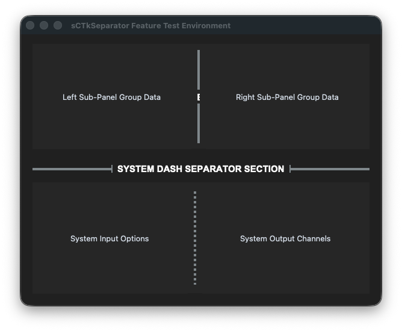
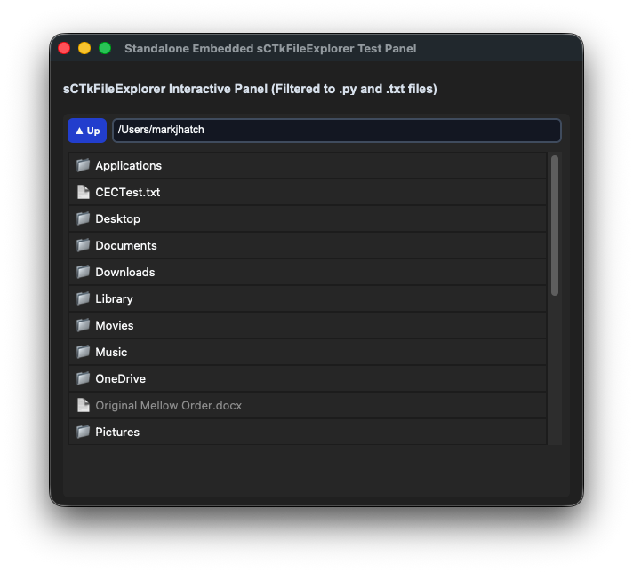

# sCustomTkinter Technical Reference
This document contains the reference documentation for the specialized sCTk CustomTkinter layout toolkit. All modules are built natively using CustomTkinter vector elements, ensuring clean scaling across high-DPI panels and full dual-profile theme compliance (Light/Dark) modes.

---

# Contents
* [Overview](#overview)
* [Architecture](#architecture)
* [Pygubu-Designer Integration](#pygubu-designer-integration)
* [Containers](#containers)
* [Control and Display](#control-and-display)
  * [sCTkSeparator](#sctkseparator)
* [Menus](#menus)
* [Dialogs](#dialogs)
* [Enhanced Widgets](#enhanced-widgets)
* [Notes](#notes)


# Overview
This library, derived from [CustomTkinter](https://github.com/tomschimansky/customtkinter), 
was developed to provide multiple types of buttons, labels, as well as additional enhanced widgets. The leading "s" in sCustomTkinter is there to acknowledge that many of the widgets are a direct subclass of CustomTkinter.


Although CustomTkinter does provide the concept of themes, it doesn't support different styles for individual a widget. For example, a button used for an option that is the typical final
end point for a dialog, might be a different size, color, boundary, etc then a less likely used button. Similarly, important Labels might be
larger and different colors than labels containing informational text.


Obviously, there are multiple coding workarounds to achieving this same objective. But if at some future point I want to change the style of any given widget,
I could go to a central theme file and not have to searching through code to make a consistent change. 


The sCustomTkinter widget provides this facility with a central theme file where "sCTkThemes.py". This them file which is very similar to the themes format of CustomTkinter, can be  easily edited by hand and changes seen immediately on next launch of the application with no coding changes. 


# Architecture
All custom layout components inherit properties and configuration data from ThemeableWidget and pull values out of the shared style sheet registry THEME_DEFAULTS inside sCTkThemes.py.
# CustomTkinter vs. sCustomTkinter Theming & Architecture Comparison

## 1. Core Structural Differences

Standard CustomTkinter uses a global, monolithic theme model. It cannot naturally support unique style configurations (like Primary, Secondary, and Ghost buttons) for the same underlying widget class from a single JSON configuration. 

Your `sCustomTkinter` library circumvents this limitation by using a **Separated Class Architecture**. It isolates each unique style variant into independent class scripts supported by separate user-interface and business-logic files.

### Standard CustomTkinter
* **Theming Style**: Single entry per widget class name (`"CTkButton"`).
* **Implementation**: Relies on a single class; variations require manual parameter arguments inside each button instance.
* **Theme Switching**: Hardcoded to look only at the native keys provided by the default CustomTkinter framework.

### sCustomTkinter (Your Framework)
* **Theming Style**: Unique entries matched to separate classes (`"sCTkButtonPrimary"`, `"sCTkButtonSecondary"`, etc.) within your main JSON theme file.
* **Implementation**: Uses dedicated semantic classes. This completely keeps style strings out of your widget instantiation parameters.
* **Theme Switching**: Handled dynamically using your custom `ThemeableWidget.py` logic wrapper.

---

## 2. Layout Architecture Comparison

| Feature | Standard CustomTkinter | Your `sCustomTkinter` Setup |
| :--- | :--- | :--- |
| **Instantiation** | `ctk.CTkButton(master, fg_color="transparent")` | `sCTkButtonTertiary(master)` *(Functions as Ghost)* |
| **Maintenance** | Manual color changes across multiple application layouts. | Clean updates across all layouts modified directly in the JSON file. |
| **File Mapping** | Everything runs under one core native layout pipeline. | Separated safely across `*ui.py`, `*bo.py`, and `ThemeableWidget.py`. |

---

## 3. Theme Configuration Mapping

By bypassing the standard CustomTkinter template restrictions, your unified JSON theme file maps distinct properties to each functional variant:

```json
{
  "sCTkButtonPrimary": {
    "fg_color": ["#1f538d", "#246cb0"],
    "hover_color": ["#14375e", "#1c5387"],
    "text_color": ["#ffffff", "#ffffff"],
    "border_width": 0
  },
  "sCTkButtonSecondary": {
    "fg_color": ["#ebebeb", "#2b2b2b"],
    "hover_color": ["#dbdbdb", "#323232"],
    "text_color": ["#000000", "#ffffff"],
    "border_width": 0
  },
  "sCTkButtonTertiary": {
    "fg_color": "transparent",
    "hover_color": ["#f0f0f0", "#2d2d2d"],
    "text_color": ["#1f538d", "#246cb0"],
    "border_width": 1,
    "border_color": ["#1f538d", "#246cb0"]
  }
}
```


# Pygubu-Designer Integration
All of the sCustomTkinter widgets can be added to your Pygubu-Designer palette by including the file sCTkWidgetSetForPygubuDesigner.py as 
a Custom Widget.  The process is:
1. Create a new project or open an existing one.
2. Put a Toplevel Window or CTK window in the project tree.
3. Click Project->Settings. Fill out the usual information. Do not add a ttk styles file because that is being handled by sCustomTkinter.
4. Click the Custom Widgets tab. Then click the "+" sign. Navigate to where sCTkWidgetSetForPygubuDesigner.py exists in your file system and click it.
5. Close the project window. You will now see a "sCustomTkinter" in the Components Palette area.

You now have access to all the sCustomTkinter widgets! You can start with a CTk ot CTkToplevel widget from CustomTkinter or a Frame or other container from sCTkCustomTkinter. 


# Containers


To follow native Tkinter conventions and avoid fragile timer overrides or initialization race conditions, all structural container classes behave as **passive geometry layout groups**. They do not actively monitor, police, or block incoming children on arrival. 

Toggling states on an entry group is handled cleanly at the application controller level using runtime children iterations (winfo_children()).

### sCTkFrame / sCTkFrameOutlined / sCTkScrollableFrame
Standard direct subclasses of native CustomTkinter frame elements wrapped in ThemeableWidget parameters. They pass arguments up to their parent layers cleanly.
```python
# Pure initialization layout pass
my_group = sCTkFrameOutlined(parent_window, border_width=2)
my_group.pack(fill="both", expand=True)
```

### sCTkFrameLabeledPrimary / sCTkFrameLabeledSecondary
Custom scrollable viewport containers that natively hide their vertical scrollbar paths by retrieving their active frame fg_color and painting the inner self._scrollbar parameters to match invisibly while setting track width to 0. 

They preserve complete compatibility with Pygubu Designer because they inherit directly from ctk.CTkScrollableFrame—allowing you to drag, drop, and pack elements inside them with native properties (label_text and label_anchor) working perfectly out of the box.
```python
# Native configurations compile fluidly inside Pygubu Designer trees
labeled_scroll_pane = sCTkFrameLabeledPrimary(
    master=app,
    label_text="System Network Configurations",
    label_anchor="w"
)
```
# Control and Display


## sCTkSeparator

(Derived from Selector class by Fastattack, 2024. This widget was made available to the community via the MIT License.  Source Repository: [MoreCustomTkinterWidgets](https://github.com/fastattackv/MoreCustomTkinterWidgets) )


The *sCTkSeparator* is an advanced, themeable divider widget for CustomTkinter. It provides dynamic scaling via layout managers, vector-drawn customizable corner radiuses, dashed/dotted line styles, and automated line-splitting centered section text headers with bounding capsule brackets.

--- 
### Widget Preview


### API Property Reference

| Property Name | Data Type | Default Value | Description |
| :--- | :--- | :--- | :--- |
| `master` | `any` | *Required* | Parent container instance (e.g., `sCTkFrame` or `ctk.CTk`). |
| `length` | `int` | `100` | The total span length of the line track in pixels (corresponds to widget height if vertical, width if horizontal). |
| `width` | `float` | `4` | The visual thickness profile of the divider line in pixels. |
| `corner_radius` | `int` or `None` | `6` (from theme) | Defines roundness sharpness of divider line endpoints (defaults to stylesheet configuration). |
| `orientation` | `str` | `"vertical"` | Sets spatial directional positioning alignment. Accepts `"vertical"` or `"horizontal"`. |
| `text` | `str` | `""` | Appends a centered section header label text directly inside a computed line split zone. |
| `font` | `tuple` or `CTkFont` | `("Arial", 11, "bold")` | Text font profile style parameters for the embedded header tag. |
| `text_color` | `str` or `Tuple[str, str]` | Central theme default | Font hex palette token string mapping. Supports appearance mode tuples. |
| `dash` | `tuple` or `None` | `None` | Integer stroke sequence array tuple mapping out dashed/dotted rendering rules (e.g., `(5, 5)`). |

---

### Centralized Stylesheet Setup (`sCTkThemes.py`)
As of the writing of this document, the current Themes for the sCTkSeparator is included below. However, the governing theme is always stored in sCTkThemes.py in your installation directory.

```python
    "sCTkSeparator": {
            # Format: (Light Mode Hex, Dark Mode Hex)
            # Softer mid-tones changed to robust crisp outlines for sharp visual separation
            "fg_color": ("#808080", "#8A9296"),
            "bg_color": "transparent",
            "corner_radius": 6,
            "font": ("Arial", 11, "bold"),
            "text_color": ("#1A1A1A", "#FFFFFF")  # Crisp high-contrast header text labels
        },
```

---

### Layout Manager Integration

Mixing layout manager tracking loops within the same immediate frame layer is completely blocked. When handling automated expansion parameters across scaling monitor resolutions, enforce the following geometry behaviors:

#### Grid Configurations (`.grid()`)
* **Horizontal Mode Line**: Must use **`sticky="ew"`** to allow the vector path to grow horizontally.
* **Vertical Mode Line**: Must use **`sticky="ns"`** to stretch the line across rows.
* **Parent Frame Setup**: The container frame track columns/rows **must** have their weights configured to let the engine allocate expanding window real estate:
  ```python
  # Column 0 and Column 2 hold widgets and expand; Column 1 isolates the separator line track
  grid_Frame.grid_columnconfigure(0, weight=1)
  grid_Frame.grid_columnconfigure(1, weight=0)
  grid_Frame.grid_columnconfigure(2, weight=1)
  ```

#### Pack Configurations (`.pack()`)
* **Horizontal Mode Line**: Must use **`fill="x"`** alongside `expand=False` so it hugs adjacent frames tightly instead of expanding into empty background rows.
* **Vertical Mode Line**: Must use **`fill="y"`** inside layout columns.

---

### Pygubu Designer Properties Guide

When configuring layouts visually within the Pygubu Designer editing workspace panel strip, observe these property formatting rules:

1. **`orientation`**: Select `vertical` or `horizontal` from the choice dropdown list pane. The preview canvas will immediately adjust orientations without flattening.
2. **`text`**: Type any section title banner sequence string directly into the entry field (e.g., `AUDIO CONTROLS`). The line will cleanly break around the text boundaries.
3. **`dash`**: Enter raw comma-separated lists of numerical values directly into the input strip **without using quote symbols or brackets**.
   * Type `5,5` for standard clean dash blocks.
   * Type `2,6` for clean dotted layout maps.
   * Leave blank or type `None` to restore solid rounded vector shapes.
4. **Dimensions with Headers**: When utilizing `text` headers on a `vertical` orientation alignment track line, remember to increase the designer **`width`** attribute setting from `4` to a larger size (e.g., `20` or `24`) to give the vertical top and bottom capsule framing lines physical canvas clearance to draw.

### Implementation Example & Test Harness

Below is a complete, self-contained test execution script demonstrating how to properly embed the `sCTkFileExplorer` inside a root window workspace panel layout using the strict two-argument callback structure.

```python
#!/usr/bin/python3
import os
import customtkinter as ctk
from sCTkSeparator import sCTkSeparator

# ==========================================
#   MAIN TESTING RUNNER CODE BLOCK
# ==========================================
if __name__ == "__main__":

    root = ctk.CTk()
    root.title("sCTkSeparator Feature Test Environment")
    root.geometry("600x450")

    grid_Frame = ctk.CTkFrame(root)
    grid_Frame.pack(side="top", fill="both", expand=True, padx=20, pady=15)

    grid_Frame.grid_columnconfigure(0, weight=1)
    grid_Frame.grid_columnconfigure(1, weight=0)
    grid_Frame.grid_columnconfigure(2, weight=1)
    grid_Frame.grid_rowconfigure(0, weight=1)

    lbl_left = ctk.CTkLabel(grid_Frame, text="Left Sub-Panel Group Data")
    lbl_left.grid(row=0, column=0, sticky="nswe")

    sep_vertical_text = sCTkSeparator(grid_Frame, orientation="vertical", text="CORE API", width=4)
    sep_vertical_text.grid(row=0, column=1, sticky="ns", padx=10, pady=10)

    lbl_right = ctk.CTkLabel(grid_Frame, text="Right Sub-Panel Group Data")
    lbl_right.grid(row=0, column=2, sticky="nswe")

    sep_horizontal_text = sCTkSeparator(root, orientation="horizontal", text="SYSTEM DASH SEPARATOR SECTION", width=15)
    sep_horizontal_text.pack(side="top", fill="x", padx=20, pady=10)

    pack_frame = ctk.CTkFrame(root)
    pack_frame.pack(side="bottom", fill="both", expand=True, padx=20, pady=(5, 20))

    panel_a = ctk.CTkLabel(pack_frame, text="System Input Options")
    panel_a.pack(side="left", fill="both", expand=True)

    sep_dashed = sCTkSeparator(pack_frame, orientation="vertical", width=4, dash=(4, 4))
    sep_dashed.pack(side="left", fill="y", padx=10, pady=15)

    panel_b = ctk.CTkLabel(pack_frame, text="System Output Channels")
    panel_b.pack(side="right", fill="both", expand=True)

    root.mainloop()
```

# Menus
# Dialogs
The creation of an advanced user dialogue panel is a structured, multi-step process in the sCustomTkinter system. This flow decouples structural layouts from operational code.

## Step-by-Step Implementation Workflow

### Step 1: Initialization inside Pygubu-Designer
1. Open Pygubu-Designer and create a new clean project space (e.g., settingMachine).
2. Add a standard **CTkToplevel** widget into your visual workspace canvas.
3. Open the **Settings** panel, select the **Compound Subclass** choice option, and fill out your specific values for both the object name and your desired file package destination folder. 
4. *Note:* Leave the **Styles** option entirely blank. If custom components are missing from your layout pane options, register them via the **Custom Widget** setup tab first.
5. **Important:** Now, delete the placeholder CTkToplevel element you just generated from the design tree hierarchy.
6. Add the **sCTkDialogCore** custom component widget straight into your design workspace canvas (rename the instance label identifier token if desired).
7. Return to the visual **Settings** pane and assign your main layout widget reference target to lock onto the **sCTkDialogCore** element you just added.
8. Save your visual designer tree.

### Step 2: Adding Content to the Dialog
1. With your active Pygubu-Designer project open, drag and direct additional custom sCTk input widgets directly onto the dialog canvas shell.
2. All inputs will align and organize themselves natively within the designated **Content Area**.
3. Customize your layout properties freely, setting row grid parameters, cell constraints, or pixel padding metrics (padx / pady).
4. Operational buttons, titles, and confirmation click handlers can be configured or swapped later via built-in convenience methods.
5. Save your work and select **Generate Code**.

### Step 3: Customizing Generated Class Code
1. Open your top-level operational class file in your script editor space. Focus on **classname.py** (do NOT modify the structural baseline file classnameui.py).
2. Inject the following import declaration line at the absolute top of the module file structure:
   ```python
   from sCTkDialogMixin import sCTkDialogMixin
   ```
3. Inject the dialog mixin token straight into your class definition inheritance chain. Your original generated definition line will look like this:
   ```python
   class classname(baseui.classnameUI):
   ```
   Modify it to include the helper mixin parameter like this:
   ```python
   class classname(sCTkDialogMixin, baseui.classnameUI):
   ```

---

## Built-in Convenience Functions Reference

### Dialogue & Window Management

*   **self.onDeleteWindow()**  
    Trigger hook bound to handle standard system Window Manager intercept close requests (e.g. clicking the top title bar "X" close circle).
*   **self.dialogClose()**  
    Call programmatically anywhere inside your controller script functions to instantly dismiss, unbind, and destroy the open dialog modal screen.
*   **self.runAndWait()**  
    Locks focus onto the window and forces the dialog into a strict **Modal (Blocking)** interaction state. The script will halt execution on that thread until the window closes. If this method is not explicitly called, the dialog window remains **Non-Modal (Fluid)**.
*   **self.setTitle(title: str)**  
    Dynamically rewrites the text string displayed at the top left of the native operating system window header shell wrapper.

### Viewport & Button Content Management

*   **self.setHeading(heading=None, anchor=None)**  
    Modifies the core header label text printed above the content grid. The anchor string input accepts standard parameters: "w", "e", or "center". All alternative anchor inputs are ignored. Passing None to either argument results in no modification to that specific layout parameter.
*   **self.setTwoButton()**  
    Configures the window button row to display exactly two functional controls: an **Apply** action button and a **Cancel** shortcut button.
*   **self.setApplyButton(buttonName=None, ButtonCommand=None)**  
    Configures the label text string and click callback function pointer for the primary validation button. Passing None preserves current settings. Returns True.
*   **self.setCancelButton(buttonName=None, ButtonCommand=None)**  
    Configures the label text string and click callback function pointer for the exit shortcut button. Passing None preserves current settings. Returns True.
*   **self.setResetButton(buttonName=None, ButtonCommand=None)**  
    Configures the label text string and click callback function pointer for the secondary option button. Passing None preserves current settings. If the internal reset button component has been previously destroyed or unmapped, no updates occur and it returns False. Otherwise, parameters align and it returns True.

# Enhanced Widgets


## sCTkDial

The sCTkDial suite provides a group of theme-adaptive, object-oriented mechanical rotary knob widgets engineered explicitly for ham radio desktop console interfaces. Derived from an abstract base core (`sCTkDialBase`), each distinct child class utilizes specialized vector graphics rendering paths and distinct input damping to mimic authentic radio console hardware while translating telemetry arrays into strict, application-friendly integers. Although originally designed for ham radio applications, these virtual dials can be used for many other applications.

---

### Widget Preview


---

## sCTkDialSelector

Designed to mimic a physical multi-position rotary band or mode selection switch. It restricts pointer operations to fixed angular arcs, strips out all distracting intermediate tick subdivisions, and loops infinitely past boundary edges.

### Constructor
```python
sCTkDialSelector(master=None, labels=None, arc_angle=270, command=None, diameter=120, width=120, height=120, **kw)
```

### ### API Property Reference

| Property Name          | Data Type | Default Value | Description |
|:-----------------------| :--- | :--- | :--- |
| `master`               | `Widget` | `None` | Reference pointer tracking the parent parent `sCTkFrame` or root context window layout layer. |
| `labels`               | `List[str / int]` | `["POS 1", "POS 2", "POS 3"]` | Explicit array of text choice options to map uniformly around the configured arc sweep. |
| `arc_angle`            | `int / float` | `270` | Total active angular sweep area in degrees, automatically centered symmetrically at the top. |
| `command`              | `callable` | `None` | **Primary Event Callback:** Fired instantly on rotation. Passes a strict, positive 0-based index integer matching the position in your labels list array. |
| `left_click_callback`  | `callable` | `None` | Custom macro callback triggered on canvas Left Mouse Button clicks (e.g., handles accelerated jumps like `-2`). |
| `right_click_callback` | `callable` | `None` | Custom macro callback triggered on canvas Right Mouse Button clicks (e.g., handles accelerated jumps like `+2`). |
| `diameter`             | `int` | `120` | **Geometric Sizing Constraint:** If specified, forces a strict 1:1 square canvas container, overriding structural box parameters to guarantee a perfect circle. |
| `width`                | `int` | `120` | The explicit fallback horizontal pixel boundary box width for the widget container frame. |
| `height`               | `int` | `120` | The explicit fallback vertical pixel boundary box height for the widget container frame. |
| `state`                | `str` | `"normal"` | Set to `"normal"` for interactive tuning or `"disabled"` to freeze inputs and gray-out graphics. |

### Callback Signature & Usage


Returns a zero based positive or negative integer. Counterclockwise is negative, clockwise is positive.


#### Command 

```python
# Fires on dial rotation via mousewheel rotation (Command)
def dial_rotated(active_index: int):
```

#### left_click_callback 
```python
# Fires on left mouse button click
def dial_left_click(active_index: int):
```
#### right_click_callback 
```python
# Fires on right mouse button click
def dial_right_click(active_index: int):
```

### Dynamic Property Modifiers Live
```python
# Change the list options and arc sweep on the fly
dial_selector.configure(labels=["160M", "80M", "40M", "20M", "10M"], arc_angle=240)

# Manually snap the switch pointer directly to index notch 2
dial_selector.set(2)
```

---

### 🎛️ 2. Hard End-Stop Potentiometer (`sCTkDialRange`)

Designed for continuous absolute attenuations like Volume, Mic Gain, or RF Attenuation. It enforces hard structural end-stops (blocks wrap-around) and decouples physical graduation markings from internal tracking values.

#### Constructor
```python
sCTkDialRange(master=None, from_=0, to=100, arc_angle=270, command=None, diameter=120, width=120, height=120, divisions=5, **kw)
```

#### Parameter Reference Matrix

| Parameter Name | Data Type | Default Value | Description |
| :--- | :--- | :--- | :--- |
| `master` | `Widget` | `None` | Reference pointer tracking the parent parent `sCTkFrame` or root context window layout layer. |
| `from_` | `int` | `0` | The lower absolute mathematical limit boundary offset initializing the rotation origin baseline. |
| `to` | `int` | `100` | The upper absolute mathematical limit boundary offset representing the maximum end-stop value. |
| `divisions` | `int` | `5` | The physical number of graduation calibration tick marks drawn uniformly around the dial perimeter. |
| `arc_angle` | `int / float` | `270` | Total active angular sweep area in degrees, automatically centered symmetrically at the top. |
| `command` | `callable` | `None` | **Primary Event Callback:** Fired instantly on rotation. Passes the current absolute position integer clamped between `from_` and `to`. |
| `left_click_callback` | `callable` | `None` | Custom macro callback triggered on canvas Left Mouse Button clicks (e.g., handles accelerated jumps like `-2`). |
| `right_click_callback` | `callable` | `None` | Custom macro callback triggered on canvas Right Mouse Button clicks (e.g., handles accelerated jumps like `+2`). |
| `diameter` | `int` | `120` | **Geometric Sizing Constraint:** If specified, forces a strict 1:1 square canvas container, overriding structural box parameters to guarantee a perfect circle. |
| `width` | `int` | `120` | The explicit fallback horizontal pixel boundary box width for the widget container frame. |
| `height` | `int` | `120` | The explicit fallback vertical pixel boundary box height for the widget container frame. |
| `state` | `str` | `"normal"` | Set to `"normal"` for interactive tuning or `"disabled"` to freeze inputs and gray-out graphics. |

#### Callback Signature & Usage
```python
# Emits absolute tracking value integers
def on_volume_pot_rotated(absolute_value: int):
    # Wheel impulses step by 5 units automatically to keep the potentiometer fast and snappy
    print(f"Transceiver Audio Gain updated to: {absolute_value}%")
```

#### Dynamic Property Modifiers Live
```python
# Re-calibrate a volume pot into a coarse squelch attenuator with 2 ticks
dial_range.configure(from_=0, to=10, divisions=2)

# Manually force the potentiometer value to absolute index 50
dial_range.set(50)

---

### 🎛️ 3. Infinite Flywheel Tuning Wheel (`sCTkDialContinuous`)

Designed exclusively for Variable Frequency Oscillators and rapid continuous menu rolling. It spins infinitely in 360-degree vectors, ignoring absolute limit boundaries completely.

### Constructor
```python
sCTkDialContinuous(master=None, divisions=24, command=None, left_click_callback=None, right_click_callback=None, diameter=120, width=120, height=120, **kw)
```

#### Parameter Reference Matrix

| Parameter Name | Data Type | Default Value | Description |
| :--- | :--- | :--- | :--- |
| `master` | `Widget` | `None` | Reference pointer tracking the parent parent `sCTkFrame` or root context window layout layer. |
| `divisions` | `int` | `24` | Number of detented layout index points tracked inside a single 360° visual turn of the dimple indicator. |
| `command` | `callable` | `None` | **Primary Event Callback:** Fired instantly on rotation. Passes a signed step velocity delta integer (`+1` for CW, `-1` for CCW). |
| `left_click_callback` | `callable` | `None` | Custom macro callback triggered on canvas Left Mouse Button clicks (e.g., handles accelerated jumps like `-2`). |
| `right_click_callback` | `callable` | `None` | Custom macro callback triggered on canvas Right Mouse Button clicks (e.g., handles accelerated jumps like `+2`). |
| `diameter` | `int` | `120` | **Geometric Sizing Constraint:** If specified, forces a strict 1:1 square canvas container, overriding structural box parameters to guarantee a perfect circle. |
| `width` | `int` | `120` | The explicit fallback horizontal pixel boundary box width for the widget container frame. |
| `height` | `int` | `120` | The explicit fallback vertical pixel boundary box height for the widget container frame. |
| `state` | `str` | `"normal"` | Set to `"normal"` for interactive tuning or `"disabled"` to freeze inputs and gray-out graphics. |

#### Callback Signature & Usage
```python
# Emits signed directional step velocity deltas (+1, -1, +2, -2)
def on_vfo_wheel_rotated(signed_step_delta: int):
    global current_frequency_hz
    # Multiply raw step increments by a simulated 100 Hz tuning channel step
    current_frequency_hz += signed_step_delta * 100
    refresh_frequency_display()
```

#### Dynamic Property Modifiers Live
```python
# Dynamically re-scale the heavy VFO flywheel container box size instantly at runtime
tuning_dial.configure(diameter=140)

# Manually advance the 3D visual dimple layout coordinates by an integer tracking step delta
tuning_dial.set_position_index(1)
```

---

### 🎨 Centralized Stylesheet Integration (`sCTkThemes.py`)

The suite fully complies with standard design systems and loads its parameters dynamically from your central dictionary theme registry based on active child class names. Make sure your shared configuration entries contain these exact tokens to maintain layout unity:

```python
THEME_DEFAULTS = {
    "sCTkDial": {
        "fg_color": ("#F1F5F9", "#0A0A0A"),       
        "text_color": ("#1A4375", "#FF9100"),     
        "dial_color": ("#9E9E9E", "#2A2F3D"),     
        "shadow_color": ("#CBD5E1", "#02040A"),
        "disabled_text_color": ("#94A3B8", "#4B5563"),
        "disabled_dial_color": ("#E2E8F0", "#1A1D24"),
        "disabled_dimple_glow": ("#CBD5E1", "#334155")
    },
    "sCTkDialSelector": {
        "fg_color": ("#F1F5F9", "#0A0A0A"),       
        "text_color": ("#1A4375", "#FF9100"),     
        "dial_color": ("#9E9E9E", "#2A2F3D"),     
        "shadow_color": ("#CBD5E1", "#02040A"),
        "pointer_color": ("#1A4375", "#FF9100"),   
        "disabled_text_color": ("#94A3B8", "#4B5563"),
        "disabled_dial_color": ("#E2E8F0", "#1A1D24")
    },
    "sCTkDialRange": {
        "fg_color": ("#F1F5F9", "#0A0A0A"),       
        "text_color": ("#1A4375", "#64748B"),     
        "dial_color": ("#9E9E9E", "#2A2F3D"),     
        "shadow_color": ("#CBD5E1", "#02040A"),
        "pointer_color": ("#1A4375", "#FF9100"),   
        "disabled_text_color": ("#94A3B8", "#4B5563"),
        "disabled_dial_color": ("#E2E8F0", "#1A1D24")
    },
    "sCTkDialContinuous": {
        "fg_color": ("#F1F5F9", "#0A0A0A"),       
        "text_color": ("#1A4375", "#FF9100"),     
        "dial_color": ("#1E293B", "#181E2B"),     
        "shadow_color": ("#CBD5E1", "#02040A"),
        "pointer_glow_color": ("#CBD5E1", "#3A455C"), 
        "disabled_text_color": ("#94A3B8", "#4B5563"),
        "disabled_dial_color": ("#E2E8F0", "#1A1D24"),
        "disabled_dimple_glow": ("#CBD5E1", "#334155")
    }
}
```

## sCTkFileExplorer Component Documentation

The `sCTkFileExplorer` is a highly configurable, theme-compliant custom file and folder navigation panel. Designed as an embedded, nested component layout rather than a separate popup dialog frame, it maps absolute directory environments onto a scannable canvas area. Valid files and subfolders render with custom graphical glyphs, while invalid or filtered file records are dynamically dimmed and locked out from interactions. 

This component supports a strict runtime `disabled` state configuration, dynamically desaturating typography elements, freezing scrollbar navigation, and locking out item selection events globally when running inside embedded container tabs.

---


### 📋 API Constructor Reference

```python
sCTkFileExplorer(master, type="directory", filetypes=None, initialdir=None, initialfile=None, command=None, double_click_command=None, width=400, height=300, corner_radius=None, border_width=None, bg_color="transparent", fg_color=None, border_color=None, background_corner_colors=None, overwrite_preferred_drawing_method=None, **kwargs)
```

| Parameter Name | Data Type | Default Value | Description |
| :--- | :--- | :--- | :--- |
| `master` | `any` | *Required* | Reference pointer tracking your root window, parent layout layer, or container frame capsule. |
| `type` | `str` | `"directory"` | Structural layout operation mode. Options: `"directory"` (renders folders only) or `"file"` (renders folders and compatible files). |
| `filetypes` | `list` / `str` | `None` | Filter array masking permitted file extensions. Formatted as an explicit python list or bracketed string array (e.g., `['.py', '.txt']`). Defers to unfiltered mode when `None`. |
| `initialdir` | `str` | `None` | Starting navigation folder pathway string. Supports tilde user expansion (`~`) and forces normalization to absolute paths at instantiation. Defaults to `os.getcwd()` if omitted. |
| `initialfile` | `str` | `None` | Default starting highlight target file path string. Highlights and selects the specified file asset row automatically on boot. |
| `command` | `callable` | `None` | Single-click method event callback triggered instantly whenever a valid, active list row is highlighted. Requires a strict **two-argument footprint**. |
| `double_click_command` | `callable` | `None` | Double-click selection method callback executed when an active row file is confirmed or executed. Requires a strict **two-argument footprint**. |
| `width` | `int` | `400` | Manual horizontal width constraint boundary dimension allocated to the explorer component measured in pixels. |
| `height` | `int` | `300` | Manual vertical height constraint boundary dimension allocated to the explorer component measured in pixels. |

---

### ⚡ Execution Event Callbacks (`command` & `double_click_command`)

Both callback functions execute dynamically when rows are manipulated by the user. To prevent application layer traceback drops, **any method mapped to these commands must accept exactly two mandatory arguments**:

```python
def my_explorer_callback(widget_instance, selected_path):
    """
    Mandatory Callback Signature Requirement
    
    1. widget_instance: The sCTkFileExplorer object triggering the method loop.
    2. selected_path:   The absolute string file path matching the row just clicked.
    """
    print(f"Action detected from {widget_instance}: Processing path -> {selected_path}")
```

* **`command`**: Triggers when a folder or file row is highlighted on a single click. Passes the updated absolute string path of the row item as the second parameter.
* **`double_click_command`**: Triggers when an active row item is double-clicked. If the targeted row is a subdirectory, the explorer automatically expands and steps *into* that directory. If the item is a valid file asset, it hands structural control back to the callback method, passing the absolute file location path.

---

### 🎨 Centralized Stylesheet Integration (`sCTkThemes.py`)

The file explorer queries your repository styling map profile matrix using `ThemeableWidget._resolve_color()` lookup routines. This decoupling ensures that layout shapes, font styles, and path row aesthetics repaint smoothly during real-time theme profile adjustments.

To satisfy the framework configuration guidelines, ensure your theme matrix includes this structured asset block:

```python
THEME_DEFAULTS = {
    "sCTkFileExplorer": {
        # Typography configurations assigned to management controls and row labels
        "btn_font": ("Arial", 11, "bold"),
        "entry_font": ("Arial", 12, "normal"),
        
        # Upper navigational button styling variables
        "btn_fg": ("#3B82F6", "#1D4ED8"),
        "btn_hover": ("#2563EB", "#1E40AF"),
        "btn_text_color": ("#FFFFFF", "#F9FAFB"),
        "btn_border_color": ("#1E3A8A", "#1E3A8A"),

        # Path display address input cell field colors
        "entry_fg": ("#FFFFFF", "#111827"),
        "entry_text_color": ("#1F2937", "#F9FAFB"),
        "entry_border_color": ("#CBD5E1", "#475569"),

        # Live File Row Rendering Palette Look Parameters
        "row_active_text": ("#1F2937", "#F9FAFB"),       # Color applied to valid choices
        "row_dimmed_text": ("#94A3B8", "#64748B"),      # Soft contrast color applied to filtered elements

        # Cascading State Lockdown Controllers
        "disabled_map": {
            "btn_fg": ("#CBD5E1", "#334155"),
            "btn_border_color": ("#CBD5E1", "#334155"),
            "btn_text_color": ("#94A3B8", "#64748B"),
            "entry_fg": ("#F3F4F6", "#1F2937"),
            "entry_border_color": ("#CBD5E1", "#475569"),
            "entry_text_color": ("#94A3B8", "#64748B"),
            "row_active_text": ("#94A3B8", "#64748B")
        }
    },
    # ... your other widget entries
}
```

---

### Implementation Example & Test Harness

Below is a complete, self-contained test execution script demonstrating how to properly embed the `sCTkFileExplorer` inside a root window workspace panel layout using the strict two-argument callback structure.

```python
#!/usr/bin/python3
import os
import customtkinter as ctk
from sCTkFileExplorer import sCTkFileExplorer


class FileExplorerTesterApp(ctk.CTk):
    def __init__(self):
        super().__init__()
        
        self.title("Standalone Embedded sCTkFileExplorer Test Panel")
        self.geometry("600x500")
        
        # Configure root layout grid weighting
        self.columnconfigure(0, weight=1)
        self.rowconfigure(1, weight=1)
        
        # Upper descriptive text label block
        self.header_lbl = ctk.CTkLabel(
            self, 
            text="sCTkFileExplorer Interactive Panel (Filtered to .py and .txt files)",
            font=("Arial", 14, "bold")
        )
        self.header_lbl.grid(row=0, column=0, padx=15, pady=(15, 5), sticky="w")
        
        # Initialize and mount the custom layout file explorer
        self.explorer = sCTkFileExplorer(
            self,
            type="file",
            filetypes=[".py", ".txt"],
            initialdir="~",  # Gracefully handles tilde user space expansions
            command=self.track_single_click_highlight,
            double_click_command=self.execute_double_click_selection,
            width=570,
            height=400
        )
        self.explorer.grid(row=1, column=0, padx=15, pady=10, sticky="nsew")

    def track_single_click_highlight(self, widget_instance, selected_path):
        """Fires instantly whenever an active directory list item is focused."""
        print(f"SINGLE-CLICK FOCUS -> Triggered by: {widget_instance}")
        print(f"                       Selected Path: {selected_path}\n")

    def execute_double_click_selection(self, widget_instance, selected_path):
        """Fires when an item row is successfully double-clicked or confirmed."""
        print(f"🚀 DOUBLE-CLICK CONFIRMED! Target: {selected_path}")
        if os.path.isfile(selected_path):
            print(f"Executing explicit business logic handler rules on target asset file.")


if __name__ == "__main__":
    # Initialize the main loop wrapper
    app = FileExplorerTesterApp()
    app.mainloop()
```

## sCTkMessage
##### Derived from Selector class by Fastattack, 2024.   Source Repository: [MoreCustomTkinterWidgets](https://github.com/fastattackv/MoreCustomTkinterWidgets)  
<br>

The `sCTkMessage` is an advanced, themeable dialog window system subclassed from `ctk.CTkToplevel` and integrated with `ThemeableWidget`. It replaces standard OS message alerts with modular, center-positioned dialogue boxes featuring dynamic text-wrapping, automated parent window tracking calculations, custom asset handling, and support for dual high-contrast action selection layouts that return boolean runtime parameters.

---

### 🛠️ System Architecture Overview

The subsystem operates dynamically at runtime through execution logic chains. Because modal dialog boxes are instantiated procedurally within code event callbacks rather than being statically placed, **this component does not require a Pygubu Builder Object (BO) file.**

The architecture is divided into the following layout segments:
1. **`sCTkMessage.py`**: Contains the top-level window manager tracking rules, uniform grid button size distributions, and global functional shortcut wrappers.
2. **`images/` Subdirectory**: A localized storage assets folder matching your component layout containing custom graphic files.
   * `info.png`, `warning.png`, `error.png` *(Standard Light Mode Assets)*
   * `info_dark.png`, `warning_dark.png`, `error_dark.png` *(High-Contrast Dark Mode Overrides)*

---

### 📋 API Constructor Reference

```python
sCTkMessage(title, message, typ, master=None, buttons="ok", ok_text="Ok", yes_text="Yes", no_text="No", width=400)
```

| Parameter Name | Data Type | Default Value | Description |
| :--- | :--- | :--- | :--- |
| `title` | `str` | *Required* | Text displayed inside the top operating window header bar title deck. |
| `message` | `str` | *Required* | Body text string message container paragraph to display inside the prompt panel. |
| `typ` | `str` | *Required* | Alert asset track type classification identifier. Accepts `"info"`, `"warning"`, or `"error"`. |
| `master` | `any` | `None` | Reference pointer tracking your root window or parent `sCTkFrame` to calculate centering bounds. |
| `buttons` | `str` | `"ok"` | Layout selection control mapping. Accepts `"ok"` (single center prompt) or `"yes_no"` (twin balanced selections). |
| `ok_text` | `str` | `"Ok"` | Custom display string label mapped to the single button layout option track. |
| `yes_text` | `str` | `"Yes"` | Display string assigned to the primary confirmation button choice track. |
| `no_text` | `str` | `"No"` | Display string assigned to the secondary dismissal button choice track. |
| `width` | `int` | `400` | Manual window width boundary tracking restriction limit measured in pixels. |

---

### ⚡ Global Shortcut Function Handlers

To launch modal dialog blocks quickly inside callback triggers without handling complete class instantiations manually, utilize these pre-wired functional shortcuts:

#### Standard Alert Prompts (Returns `True` upon closure)
```python
showinfo(title, message, ok_text="Ok", width=400, master=root)
showwarning(title, message, ok_text="Ok", width=400, master=root)
showerror(title, message, ok_text="Ok", width=400, master=root)
```

#### Confirmation Prompt Shortcuts (Returns primitive Python `True` or `False` boolean states)
```python
askyesno(title, message, yes_text="Yes", no_text="No", width=400, master=root)
askwarningyesno(title, message, yes_text="Yes", no_text="No", width=400, master=root)
askerroryesno(title, message, yes_text="Yes", no_text="No", width=400, master=root)
```

---

### 🎨 Centralized Stylesheet Integration (`sCTkThemes.py`)

The component relies heavily on your centralized style dictionary system. To prevent the mixin parser tracking structures from raising runtime validation faults, verify your shared stylesheet contains this asset entry:

```python
THEME_DEFAULTS = {
    "sCTkMessage": {
        "font": ("Arial", 14),
        "text_color": ("#1A1A1A", "#E5E5E5") # (Stark Charcoal, Soft Off-White)
    },
    # ... your other widget entries
}
```

---

### 📐 Layout & Text Wrapping Integration Rules

To completely bypass CustomTkinter's internal multi-line font calculation limitations, this widget uses Python's native `textwrap` module to inject hard newline coordinates before passing layout parameters to your primary text components.

Observe these implementation traits:
* **Horizontal Capsule Brackets**: When `buttons="yes_no"` is active, Column 0 and Column 1 utilize an interlocking `uniform="dialog_buttons"` constraint map. This completely locks both buttons to an identical layout grid pixel width, regardless of text length mismatches.
* **Vertical Safety Gutter**: Text layout nodes use `padx=(10, 35)` paired alongside a calculated character width subtraction map. This forces word bounds to drop downwards well before interacting with the physical window frame margin boundary.
* **Autonomous Resizing**: The `_center_window` geometry calculations lock your custom manual `width` pixel profile constraint, but query the active required widget layout height parameters dynamically via `winfo_reqheight()`. This allows window frames to expand or shrink vertically based on your text content volume requirements automatically.


## sCTkSMeter Component Documentation

The `sCTkSMeter` is a classical analog S-Meter/Output for a Ham Radio Transceiver. Like all sCTk widgets, it is theme-adaptive.

---

### 📋 API Constructor Reference

```python
sCTkSMeter(master=None, width=340, height=130, **kw)
```

| Parameter Name | Data Type | Default Value | Description |
| :--- | :--- | :--- | :--- |
| `master` | `any` | `None` | Reference pointer tracking your root window or parent `sCTkFrame` container layout layer. |
| `width` | `int` | `340` | Manual hardware panel horizontal width boundary tracking profile measured in pixels. |
| `height` | `int` | `130` | Manual hardware panel vertical height boundary tracking profile measured in pixels. |

---

### ⚡ Global Object Instance Methods

To drive the meter pointer sweep dynamics smoothly inside background tracking threads, frequency scanning routines, or telemetry stream updates, utilize this core value setter:

#### Update Instrument Needle Value
```python
# Updates pointer positioning 
smeter.set(value)
```

### 🎨 Centralized Stylesheet Integration (`sCTkThemes.py`)

The component relies heavily on your centralized style dictionary system. To prevent the mixin parser tracking structures from raising runtime validation faults during initialization cycles, verify your shared stylesheet contains this asset configuration block:

```python
THEME_DEFAULTS = {
    "sCTkSMeter": {
        # Light Mode: Clean White Face | Dark Mode: Deep Obsidian Cockpit Black
        "fg_color": ("#FFFFFF", "#0A0A0A"),       
        
        # High-Contrast Brand Blue for bright rooms / Illuminated Glowing Neon Amber for dark setups
        "text_color": ("#1A4375", "#FF9100"),     
        
        # Solid High-Contrast Crimson / Intense Mechanical Redline alert arc warning zone
        "alarm_color": ("#990000", "#FF2200"),    
        
        # Deep Cobalt-Navy Slate indicator pointer / Blazing Orange needle tracking sweep
        "needle_color": ("#112A4B", "#FF9100")    
    },
    # ... your other widget entries
}
```

## sCTkSMeterBar

The `sCTkSMeterBar` is a standalone, low-profile horizontal discrete LED segment bar widget displaying simultaneous, independent tracks for incoming S-Units, transmitter SWR ratio levels, and forward RF Power output percentage. Like all sCTk widgets, it is theme-adaptive.

---

### 📋 API Constructor Reference

```python
sCTkSMeterBar(master=None, swr_max_value=5.0, swr_visible=True, pwr_visible=True, hide_lower_row=False, width=340, height=110, **kw)
```

| Parameter Name | Data Type | Default Value | Description |
| :--- | :--- | :--- | :--- |
| `master` | `any` | `None` | Reference pointer tracking your root window or parent `sCTkFrame` container layout layer. |
| `swr_max_value` | `int` / `float` | `5.0` | The explicit maximum scale boundary representing the far right edge limit tracking your transmitter's SWR track. |
| `swr_visible` | `bool` | `True` | Visibility flag for the SWR cluster. Flipping to `False` shifts the text, ticks, and active LEDs into a faded, disabled palette look. |
| `pwr_visible` | `bool` | `True` | Visibility flag for the PWR cluster. Flipping to `False` shifts the text, ticks, and active LEDs into a faded, disabled palette look. |
| `hide_lower_row` | `bool` | `False` | Layout override command. When `True`, the entire lower instrumentation cluster collapses and vanishes, pushing the `SIG` bar to the true vertical center of the card footprint. |
| `width` | `int` | `340` | Manual hardware panel horizontal width boundary tracking profile measured in pixels. |
| `height` | `int` | `110` | Manual hardware panel vertical height boundary tracking profile measured in pixels. |

---

### ⚡ Global Object Instance Methods

#### Update Instrument Telemetry Channels
```python
# Pass parameters to update any of the 3 telemetry rows independently on the fly
led_bar_gauge.set(s_value=9.2, swr_value=1.4, pwr_value=45.0)
```

#### Live Layout Configuration Modifier
```python
# Updates layout presentation properties on the fly without reconstruction overhead
led_bar_gauge.configure_visibility(swr_visible=False, pwr_visible=True, hide_lower_row=False)
```

---

### 🎨 Centralized Stylesheet Integration (`sCTkThemes.py`)

The component relies heavily on your centralized style dictionary system. To prevent the mixin parser tracking structures from raising runtime validation faults, verify your shared stylesheet contains this asset configuration block:

```python
THEME_DEFAULTS = {
    "sCTkSMeterBar": {
        # Light Mode: Clean White Face | Dark Mode: Deep Obsidian Cockpit Black
        "fg_color": ("#FFFFFF", "#0A0A0A"),       
        
        # High-Contrast Brand Blue for bright rooms / Illuminated Glowing Neon Amber for dark setups
        "text_color": ("#1A4375", "#FF9100"),     
        
        # Solid High-Contrast Crimson / Intense Mechanical Redline alert segment zones
        "alarm_color": ("#DC2626", "#FF2200"),    
        
        # Active illuminated LED block color tracks mapped out below threshold limits
        "led_on_color": ("#2471A3", "#FF9100"),   
        
        # Unlit background matrix segment pockets visible behind dark/inactive areas
        "led_off_color": ("#E2E8F0", "#1A1D20")   
    },
    # ... your other widget entries
}
```

## sCTkPathChooser Component Documentation
___
The `sCTkPathChooser` is a custom compound widget that integrates a fluid layout data entry text field with an interactive file system directory browse button. The outer container manages the structural framing and boundary envelope dimensions, while the inner text field stretches dynamically to occupy available layout space. Clicking the action button initializes a modal document viewer popup window that lets users visually navigate absolute file paths using an underlying `sCTkFileExplorer` panel.

---

### 📋 API Constructor Reference

```python
sCTkPathChooser(master=None, type="directory", filetypes=None, initialdir=None, initialfile=None, command=None, justify="left", entry_height=32, btn_width=110, btn_height=32, btn_text=None, browser_width=500, browser_height=450, width=350, height=32, state="normal", **kwargs)
```

| Parameter Name | Data Type | Default Value | Description |
| :--- | :--- | :--- | :--- |
| `master` | `any` | `None` | Reference pointer tracking your root window, parent layout layer, or container frame capsule. |
| `type` | `str` | `"directory"` | Path matching configuration profile mode. Options: `"directory"` (filters out specific file entries) or `"file"` (enables selective file picking). |
| `filetypes` | `list` / `str` | `None` | Structural filter array masking permitted extensions when `type="file"`. Formatted as an explicit python list or bracketed string array (e.g., `['.py', '.txt']`). |
| `initialdir` | `str` | *Dynamic* | Default starting directory pathway location string. Supports tilde user expansion (`~`) and normalizes paths absolutely. Fallbacks to `os.getcwd()` if omitted. |
| `initialfile` | `str` | `None` | Default starting target highlight file path string. Automatically splits coordinates to derive the parent tracking folder location if necessary. |
| `command` | `callable` | `None` | Event callback method executed instantly on directory path selection changes. Requires a **single-argument string signature**. |
| `justify` | `str` | `"left"` | Content text arrangement alignment tracking mask within the entry field area. Options: `"left"`, `"center"`, `"right"`. |
| `entry_height` | `int` | `32` | Manual vertical height footprint dimension allocated specifically to the inner entry input cell in pixels. |
| `btn_width` | `int` | `110` | Manual horizontal width dimension allocated specifically to the internal browser action button in pixels. |
| `btn_height` | `int` | `32` | Manual vertical height footprint dimension allocated specifically to the internal browser action button in pixels. |
| `btn_text` | `str` | `None` | Optional label override text string applied directly into the action button button graphic. Fallbacks to dynamic context descriptions when `None`. |
| `browser_width` | `int` | `500` | Horizontal window size constraint allocated to the initialized modal sub-window popup frame in pixels. |
| `browser_height` | `int` | `450` | Vertical window size constraint allocated to the initialized modal sub-window popup frame in pixels. |
| `width` | `int` | `350` | Total structural panel horizontal footprint envelope assigned to the widget container in pixels. |
| `height` | `int` | `32` | Total structural panel vertical footprint envelope assigned to the widget container in pixels. |
| `state` | `str` | `"normal"` | Execution state controller. Toggling to `"disabled"` dims all color profiles and locks out keyboard entry and button interaction events. |

---

### ⚡ Execution Event Callback (`command`)

The custom method bound to the outer application layer command parameter must support a single positional variable assignment. The component wraps execution pipelines inside a safety fallback checker block to handle basic text adjustments or blank operations smoothly:

```python
def print_result(path):
    """
    Standard Callback Signature Footprint
    
    path: Resolves to the absolute expanded string directory pathway matching the selection.
    """
    print(f"MAIN CONSOLE PATH SELECTION -> {path}")
```

---

### ⚡ Global Object Instance Methods

#### Programmatically Set Choice Elements
```python
# Clears active entries, normalizes tilde strings, absolute expands paths, and seeds input fields
path_chooser.set("~/Documents/logs")
```

#### Fetch Active Selection Values
```python
# Pulls back the currently typed or visually selected path absolute string
current_path = path_chooser.get()
```

---

### 🎨 Centralized Stylesheet Integration (`sCTkThemes.py`)

The path chooser delegates visual presentations to centralized theme configurations. It handles real-time look transitions natively by executing lookups via `ThemeableWidget._resolve_color()`, pulling nested state data out of its private `disabled_map` tracking blocks during interaction freezes.

Ensure your central workspace theme dictionary profile sheet matches this asset entry map structure:

```python
THEME_DEFAULTS = {
    "sCTkPathChooser": {
        # Typography configurations assigned to management controls and label blocks
        "entry_font": ("Arial", 13),
        "btn_font": ("Arial", 13, "bold"),
        
        # Active layout color palette parameters
        "entry_fg": ("#F9F9FA", "#343638"),
        "entry_border_color": ("#979DA2", "#565B5E"),
        "entry_text_color": ("#000000", "#FFFFFF"),
        
        "btn_fg": ("#3B8ED0", "#1F6AA5"),
        "btn_hover": ("#2C74B3", "#144E75"),
        "btn_text_color": ("#DCE4EE", "#F9F9FA"),
        "btn_border_color": ("#3B8ED0", "#1F6AA5"),

        # Direct cascading mapping dictionary nested cleanly for the locked disabled state machine
        "disabled_map": {
            "entry_fg": ("#EAEAEA", "#2B2B2C"),
            "entry_border_color": ("#D3D3D3", "#3A3A3C"),
            "entry_text_color": ("#A0A0A0", "#7C7C7C"),
            "btn_fg": ("#D3D3D3", "#2D2F31"),
            "btn_border_color": ("#D3D3D3", "#2D2F31"),
            "btn_text_color": ("#A0A0A0", "#5A5C5E")
        }
    },
    # ... your other widget entries
}
```

---

### 💻 Implementation Example & Test Harness

Below is a complete, self-contained test execution script demonstrating how to properly map the compound `sCTkPathChooser` widget inside an application window, using its standalone layout adjustments and tracking callback engine.

```python
#!/usr/bin/python3
import customtkinter as ctk
from sCTkPathChooser import sCTkPathChooser


class CompoundComponentTesterApp(ctk.CTk):
    def __init__(self):
        super().__init__()
        
        self.title("Compound Component Test Suite")
        self.geometry("700x200")
        
        # Upper descriptive header label
        self.label = ctk.CTkLabel(
            self, 
            text="sCTkPathChooser Custom Target File Configurator:",
            font=("Arial", 12, "bold")
        )
        self.label.pack(anchor="w", padx=20, pady=(20, 0))
        
        # Initialize and configure the custom compound path chooser panel layout
        self.chooser = sCTkPathChooser(
            self,
            type="file",               # File picker operational mode
            title="Select Log Target", # Window header label text for modal sub-window popups
            filetypes=[".py"],         # Extension constraint filter mapping arrays
            command=self.print_result, # Application-layer update notification handler callback
            justify="right",           # Align entry data coordinates cleanly to the right boundary
            width=660,
            height=50,
            state="normal",
            entry_height=40,
            btn_width=40,
            btn_height=40,
            btn_text="▶",              # Override label glyph icon assigned into action button graphic
            browser_width=550,
            browser_height=500
        )
        self.chooser.pack(padx=20, pady=(5, 20), fill="x")

    def print_result(self, path):
        """Fires dynamically whenever a valid absolute path selection matches and changes."""
        print(f"MAIN CONSOLE PATH SELECTION -> {path}")


if __name__ == "__main__":
    # Execute the master testing panel wrapper window loop
    app = CompoundComponentTesterApp()
    app.mainloop()
```

## sCTkSelector
#### Derived from Selector class by Fastattack, 2024.   Source Repository: [MoreCustomTkinterWidgets](https://github.com/fastattackv/MoreCustomTkinterWidgets)  
<br>
An advanced, thematic, multi-choice selection frame component derived from Fastattack's `Selector` utility framework. This component features responsive layout management, an instant alphanumeric search filter, strict element uniqueness constraint handling, and dark/light mode asset harmonization via `ThemeableWidget`.

### Class Signature

```python
class sCTkSelector(sCTkFrame, ThemeableWidget):
    def __init__(
        self, 
        master, 
        items: Optional[list[str]] = None, 
        multiple_choices: bool = True, 
        **kwargs
    ):
```

---

### Core Operational Parameters

| Attribute | Data Type | Default | Operational Profile Description |
| :--- | :--- | :--- | :--- |
| `items` | `list[str]` | `[]` | An array containing option strings. Elements must be unique to pass structural consistency layout parsing checks. |
| `multiple_choices` | `bool` | `True` | Toggles selection modes. When `False`, choosing a checkbox auto-clears all prior checklist options. |
| `state` | `str` | `"normal"` | Accepts `"normal"` or `"disabled"`. Switching to `"disabled"` blocks input to the search entry and grays out list items based on theme settings. |
| `pack_propagate` | `bool` | `True` | Layout configuration rule option. Set to `False` to prevent the container from collapsing around sub-elements. |
| `grid_propagate` | `bool` | `True` | Layout configuration rule option. Set to `False` to lock exact geometric size grid allocations. |

---

### Programmatic API Reference

#### Primary API Methods

##### `.get_selections() -> list[str]`
Returns a list containing the text string names of all currently selected checklist entries.
* **Return Format:** `['vw', 'roadster']`

##### `.get_all_items() -> list[str]`
Returns an active lookup list of all items registered in the picker frame.
* **Return Format:** `['vw', 'porsche', 'roadster', 'tesla']`

##### `.clear_selections()`
Clears all active option checkmarks across the entire visibility tree, safely updating tracking variables.

##### `.configure(**kwargs)`
The master runtime routing pipeline. Safely typecasts layout entries from text fields, intercepting custom parameters before passing geometry attributes downward to CustomTkinter's base frame layout module.

---

#### Internal Helper Methods

The following methods manage internal callback parsing loops, view transitions, and interface layout mutations. They are executed automatically by the widget framework, but can be invoked manually or extended to handle specialized interactions.

##### `._selection(index: int)`
The master selection controller logic. Fired automatically when a user toggles any checkmark option.
* **Functional Profile:** Manages list indices within `self.selected_indexes`. If `self.multiple_choices` evaluates to `False`, it iteratively sweeps all alternative widgets, triggering their `.deselect()` events to enforce a strict radio-button style selection state.

##### `._search_modified(*args)`
The instant-filter validation scanner callback. Monitored continuously via a write trace on `self.search_var`.
* **Functional Profile:** Automatically reads string strings inside the search entry bar. It loops through `self.checkboxes`, matching substrings using `.startswith()`. Matching choices are packed inside a grid list array via `.grid()`, while non-matching rows are cleanly stripped from layout rows via `.grid_forget()`. Calls `._reset_scroll()` instantly at completion.

##### `._reset_scroll()`
Resets scroll tracking bounds whenever filters adapt.
* **Functional Profile:** Directs the hidden nested canvas mapping engine of the scrollable frame wrapper container, using its internal y-axis view modifier function (`self.checkboxes_frame._parent_canvas.yview_moveto(0)`) to snap the view coordinates back to index `0` instantly.

---

### Pygubu-Designer Inspector Integration Layout

To display and modify parameters within Pygubu-Designer's visual editor panel without breaking code generation arrays, format your inspector parameters exactly as follows:

#### 1. Visual Configuration Fields

* **`items` Field Format (Use Single Quotes Inside):**
  ```text
  ['apple', 'pear', 'orange', 'banana']
  ```
  *Note: Always use single quotes surrounding internal string strings within the entry field text box to ensure safe generation compilation without double quote nesting syntax issues.*

* **`multiple_choices` Dropdown Options:**
  * `True` *(Enables checklist multi-selection checks)*
  * `False` *(Enables radio-button style single selection mode)*

* **`state` Dropdown Options:**
  * `normal` *(Active element state operations color tracking)*
  * `disabled` *(Grayed out visual interface mode bounds)*

* **`pack_propagate` / `grid_propagate` Options:**
  * `True` *(Auto shrink-wraps to fit the child checklist elements)*
  * `False` *(Locks layout parameters explicitly to designated width/height rules)*

---

### Centralized Theme Mapping Rules (`sCTkThemes.py`)

To prevent the global framework corruption guards or null value traffic interceptors from triggering an application startup crash exception, format your `sCTkSelector` node within your theme asset dictionary file exactly as follows:

```python
THEME_DEFAULTS = {
    "sCTkSelector": {
        "fg_color": "transparent",
        "corner_radius": 6,
        
        # Centralized color settings for the disabled mode state block
        "disabled_map": {
            "text_color": ("#808080", "#666666"),  # Light Mode / Dark Mode text colors
            "fg_color": "transparent"
        },
        
        # Placeholder dictionary tags to satisfy strict initialization loop checks
        "pressed_map": {
            "state_placeholder": "none"
        },
        "alarm_map": {
            "state_placeholder": "none"
        }
    }
}
```

---

### Production Integration Example

```python
import customtkinter as ctk
from sCTkSelector import sCTkSelector

def fetch_data():
    # Retrieve current option list array selections
    active_picks = selector_widget.get_selections()
    print(f"Active dashboard criteria flags: {active_picks}")

root = ctk.CTk()
root.geometry("400x450")

# Instantiate layout component with propagation guards locked to sizing constraints
selector_widget = sCTkSelector(
    root, 
    items=["Radio Node A", "Radio Node B", "Radio Node C"],
    multiple_choices=False,
    width=350,
    height=200,
    pack_propagate=False
)
selector_widget.pack(expand=True, fill="both", padx=20, pady=20)

confirm_btn = ctk.CTkButton(root, text="Capture Selections", command=fetch_data)
confirm_btn.pack(pady=15)

root.mainloop()
```

## sCTkSpinbox

The `sCTkSpinbox` is a highly configurable, theme-compliant custom spinbox wrapper widget. It extends `ctk.CTkFrame` and aggregates an internal `sCTkEntryPrimary` alongside two stacked or flanking directional button controls. The component dynamically supports two operational tracking tracks: standard numerical incrementation step ranges, and discrete string text array index navigation. Like all sCTk widgets, it is theme-adaptive.

---

### 📋 API Constructor Reference

```python
sCTkSpinbox(master=None, from_=0.0, to=100.0, step_size=1.0, command=None, state="normal", wrap=False, justify="left", show=None, placeholder_text=None, exportselection=True, width=140, height=32, **kw)
```

| Parameter Name | Data Type | Default Value | Description |
| :--- | :--- | :--- | :--- |
| `master` | `any` | `None` | Reference pointer tracking your root window or parent layout layer capsule container. |
| `from_` | `float` | `0.0` | The lower numerical limit boundary representing the floor of your adjustment range. |
| `to` | `float` | `100.0` | The upper numerical limit boundary representing the ceiling of your adjustment range. |
| `step_size` | `float` | `1.0` | The exact mathematical offset added or subtracted from your tracking float on every button click. |
| `command` | `callable` | `None` | Optional event logging callback function executed instantly on text shifts, passing the active value. |
| `state` | `str` | `"normal"` | Execution state controller. Toggling to `"disabled"` dampens and locks out all inputs and arrows. |
| `wrap` | `bool` | `False` | Mechanical boundary iteration loop flag. When `True`, stepping past limits wraps around to alternative poles. |
| `justify` | `str` | `"left"` | Content text arrangement alignment tracking mask within the entry area. Options: `"left"`, `"center"`, `"right"`. |
| `show` | `str` | `None` | Character masking input indicator string sequence (e.g. `show="*"` for password entries). |
| `placeholder_text` | `str` | `None` | Faded background prompt text block displayed natively whenever the input cell field is completely empty. |
| `exportselection` | `bool` | `True` | Standard Tkinter selection clipboard persistence state identifier switch. |
| `width` | `int` | `140` | Manual hardware panel horizontal width layout footprint dimension measured in pixels. |
| `height` | `int` | `32` | Manual hardware panel vertical height layout footprint dimension measured in pixels. |

### 🛠️ Custom Keyword Extensions (`**kw`)
These exclusive configuration parameters override default geometry behaviors, resolve theme definitions, and style proportions dynamically:

| Extension Parameter | Data Type | Default Value | Description |
| :--- | :--- | :--- | :--- |
| `button_width` | `int` | `22` | The horizontal width tracking measurement assigned to increment/decrement button frames in pixels. |
| `button_height` | `int` | `None` | The vertical button height. If `None`, scales automatically based on active grid parameters. |
| `button_side` | `str` | `"right"` | Hardware control grid positioning side anchor layout. Options: `"right"`, `"left"`, `"split"`. |
| `orientation` | `str` | `"vertical"` | Structural grid layout arrangement axis profile track. Options: `"vertical"`, `"horizontal"`. |
| `arrow_font` | `tuple` / `str` | `None` | Typography tuple passed directly to the arrows/glyphs. Ensures runtime theme compatibility. |
| `arrow_font_size` | `int` | `8` | Typography scaling rule explicitly defining point sizes for the raw directional glyph markings inside Pygubu. |
| `format` | `str` | `""` | Numerical formatting mask specifier string rule (supports C percent styles `%.3f` or bracket masks `{:.3f}`). |
| `values` | `str` / `list` | `None` | Literal input values array string loader. Setting choices converts your widget into Discrete Text List Mode. |

---

### ⚡ Global Object Instance Methods

#### Programmatically Set Value Elements
```python
# Insert a distinct float, integer, or matching list mode text option string natively
spinbox.set(12.5)
```

#### Fetch Active Value Strings
```python
# Reaches into the data entry track, pulling back the active string layout contents
current_selection = spinbox.get()
```

#### Discrete Values Array Loader Shortcut
```python
# Programmatically inject custom space-separated lines or list records on the fly
spinbox.set_values('Low Medium High "Extreme Alert" Max')
```

#### Layout Parameter Configuration Modifier
```python
# Updates interactive structural layouts or boundaries cleanly without layout recreation overhead
spinbox.configure(orientation="horizontal", button_side="split", arrow_font_size=14, wrap=True)
```

#### Advanced Sub-Component Style Targeting
If an explicit overrides requirement arises at runtime that bypasses the compiled stylesheet definitions, you can directly interact with the isolated increment/decrement components safely without initialization crashes:
```python
# Manually altering internal button typography fonts at runtime
spinbox._sub_button_1.configure(font=("Arial", 8, "normal")) # Increment button
spinbox._sub_button_2.configure(font=("Arial", 8, "normal")) # Decrement button
```

---

### 🎨 Centralized Stylesheet Integration (`sCTkThemes.py`)

The widget relies heavily on direct index key lookups within your central styling map profile matrix. The theme mapping profile utilizes explicit arrow definitions, glyph direction markers, formatting masks, and soft contrast palettes to eliminate runtime fallback drops.

```python
THEME_DEFAULTS = {
    "sCTkSpinbox": {
        # Font family and dimensions applied natively into the tracking sCTkEntryPrimary field area
        "font": ("Arial", 15, "normal"),
        
        # Font configuration specifically assigned to resolve button arrows/glyphs
        "arrow_font": ("Arial", 8, "normal"),
        
        # Explicit directional string characters assigned to step button graphics 
        "arrow_up_char": "▲",
        "arrow_down_char": "▼",
        "arrow_right_char": "▶",
        "arrow_left_char": "◀",

        # String rendering format controller (C percent-style or python bracket mapping rules)
        "format": "%.2f",

        # Geometry footprints matching baseline sCTkEntryPrimary boundaries
        "border_width": 1.5,
        "corner_radius": 6,
        
        # Active Layout Palette Look Parameters
        "entry_color": ("#FFFFFF", "#111827"),
        "border_color": ("#1A4375", "#64748B"),
        "text_color": ("#1F2937", "#F9FAFB"),
        
        # 🎨 UPDATED SOFT CONTRAST:
        # Light Mode: Comfortable Slate Blue-Grey (#5A6E7F)
        # Dark Mode: Muted Technical Steel Blue-Grey (#526071) - Soft, readable, non-distracting
        "placeholder_text_color": ("#5A6E7F", "#526071"),
        
        "button_color": ("#9E9E9E", "#2A2F3D"),
        "button_hover_color": ("#7D7D7D", "#374151"),

        # Direct cascading mapping dictionary nested cleanly for the locked disabled state machine
        "disabled_map": {
            "entry_color": ("#F3F4F6", "#1F2937"),
            "border_color": ("#CBD5E1", "#475569"),
            "text_color": ("#94A3B8", "#64748B"),
            "button_color": ("#CBD5E1", "#334155")
        }
    }

```

## sCTkTableview Component Documentation

The `sCTkTableview` is a high-performance, theme-adaptive, and interactive data grid widget engineered specifically for the `sCustomTkinter` desktop amateur radio workspace architecture. It wraps a specialized scrollable container viewport to render structured, matrix-aligned logging rows, transceiver channels, or telemetry tracking data.

---

### 📐 Core Architecture & Environment Sync Rules

To operate seamlessly across both visual design suites and standalone Python initialization runners, the table implements a **Dual-Environment Priority Pass** constraint layout:

1. **Design Mode (`num_columns` Rules):** Within the Pygubu Designer layout studio pane, the explicit numeric sidebar options act as the source of truth. If you type more label names than `num_columns` dictates, the text is sliced down to prevent visual canvas breaking. If you type fewer labels, the trailing empty layout slots are preserved as blank spacer columns.
2. **Runtime Mode (`columns` Rules):** When executed natively in production code, the length of the list passed into the `columns=[...]` initializer constructor takes absolute authority, overriding any defaults to stretch or shrink the matrix widths dynamically.
3. **Alphabetical Optimization:** Pygubu Designer forcefully serializes configuration dictionary payloads alphabetically (causing `columns` to execute before `num_rows`). `sCTkTableview` utilizes an internal **Redraw Loop Debounce Gate** to capture all incoming parameters silently first, executing a single ordered draw pass right at the tail end to prevent layout collapse.

---

### 🛠️ Developer API Reference

### Constructor Signature

```python
table = sCTkTableview(
    master,
    columns=None,
    width=500,
    height=300,
    grid_mode="zebra",
    header_line_width=2,
    outline_width=1.0,
    outline_radius=4,
    state="normal",
    num_columns=3,
    num_rows=1,
    show_headers=True,
    cell_bg_color=None,
    cell_alt_bg_color=None,
    *args,
    **kwargs
)
```

### Public Methods

#### `load_dataset(dataset: List[List[Any]])`
Loads a 2D Python array into the active grid interface matrix canvas. 
* **Row Overflow:** If the number of incoming data rows exceeds the configured `num_rows`, the table dynamically stretches downward, scaling the scroll frame automatically.
* **Row Underflow:** If incoming data records are fewer than `num_rows`, the widget populates the cells and leaves the remaining rows blank (preserving layout proportions).

#### `get_num_rows() -> int`
Returns the true number of physical rows currently gridded on screen. This metric dynamically includes empty fallback slots and blank padding arrays.

#### `get_num_columns() -> int`
Returns the total number of structural columns currently managed inside the table, accurately counting un-labeled spacer cells.

#### `set_column_properties(column_index: int, width: int, anchor: Literal["w", "center", "e"] = "center")`
Adjusts the geometry constraints and text justification for a specific column index. Anchor tags smoothly recalculate text cell margins with tracking margin buffers.

#### `bind_selection_callback(callback: Callable[[int, List[Any]], None])`
Binds a mouse click tracking hook (`<Button-1>`) to all cell slots. Triggers the callback with the targeted row index and its matching data row list array.

#### `bind_edit_callback(callback: Callable[[int, int, str], None])`
Binds an operation interceptor hook triggered whenever an operator double-clicks a cell slot, modifies the inline `CTkEntry` field overlay, and commits changes via `<Return>` or focus loss.

#### `bind_validation_callback(callback: Callable[[int, str], bool] -> bool)`
Mounts a pre-save check gating hook before inline edits are saved to the core cell structure. Returning `False` rejects the user string and restores the original data cell text.

---

### 🎨 Visual Configuration & Style Sheet Tokens

`sCTkTableview` extracts default styling parameters directly from your centralized `THEME_DEFAULTS` dictionary, using the structural keyword token map `"sCTkTableview"`. It handles appearance changes natively, switching between dark and light modes cleanly.

| Property Keyword | Data Type | Permitted Values | Functional Output Behavior |
| :--- | :--- | :--- | :--- |
| `grid_mode` | `str` | `"grid"`, `"zebra"`, `"none"` | Changes row backgrounds. `"none"` collapses all padding to `0` for borderless flat screens. |
| `show_headers` | `bool` | `True`, `False` | Toggles the visibility of the primary header text labels. |
| `header_line_width` | `int` | `0` to `10` pixels | Size of the line divider under headers. Setting it to `0` joins rows seamlessly. |
| `state` | `str` | `"normal"`, `"disabled"` | Controls editing; `"disabled"` locks rows out from double-click cell edits. |
| `outline_width` | `float` | `0.0` to `5.0` pixels | Border line size bounding the frame layout. |
| `outline_radius` | `int` | `0` to `20` pixels | Corner roundness bounding the frame layout. |
| `cell_bg_color` | `str` / `tuple` | Color String / Hex Tuple | Primary row cell backing color override block. |
| `cell_alt_bg_color`| `str` / `tuple` | Color String / Hex Tuple | Alternating row color used to draw striping in `"zebra"` mode. |

---

### 🗃️ Complete Edge-Case Integration Sample

```python
import customtkinter as ctk
from sCTkTableview import sCTkTableview

app = ctk.CTk()
app.geometry("600x400")

# Setup 5 columns x 8 rows baseline
table = sCTkTableview(
    master=app,
    num_columns=5,
    num_rows=8,
    columns=["Callsign", "Frequency", "Mode", "Power", "Grid"],
    grid_mode="zebra"
)
table.pack(padx=20, pady=20, fill="both", expand=True)

# 🚀 Robust Overflow/Underflow Handling Sample Data Payload
# Row 3 underflows column settings (padded with blanks)
# Row 4 overflows column settings (safely truncated)
logging_payload = [
    ["W6EL", "14.074 MHz", "FT8", "50W", "DM14"],
    ["K6K7", "7.047 MHz", "CW", "100W", "CM87"],
    ["N6RE", "21.285 MHz"], 
    ["AI6IR", "144.200 MHz", "FM", "25W", "DM12", "EXTRA_FIELD_IGNORED"]
]

table.load_dataset(logging_payload)

# Execution Hook Callbacks Linkages
table.bind_selection_callback(lambda r, data: print(f"Selected Row {r}: {data}"))
table.bind_edit_callback(lambda r, c, val: print(f"Cell modified at ({r},{c}) -> New Value: {val}"))
table.bind_validation_callback(lambda c, val: len(val.strip()) > 0) # Reject empty updates

app.mainloop()
```


# Notes
***

```


