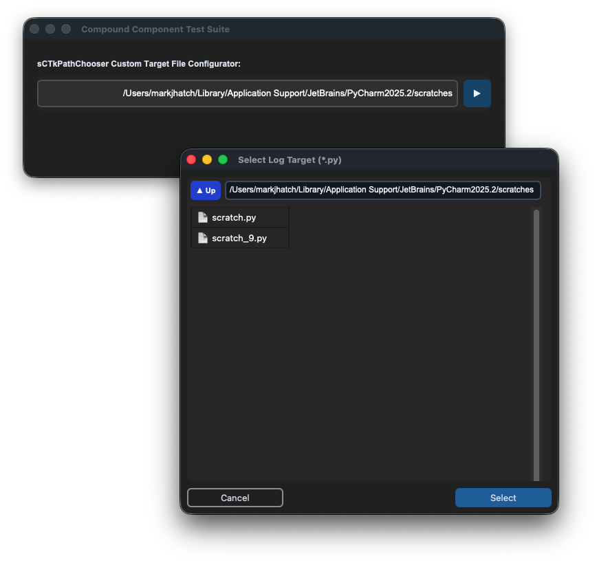

## sCTkSMeterBar

The `sCTkSMeterBar` is a standalone, low-profile horizontal discrete LED segment bar widget displaying simultaneous, independent tracks for incoming S-Units, transmitter SWR ratio levels, and forward RF Power output percentage. Like all sCTk widgets, it is theme-adaptive.

---

### 📋 API Constructor Reference

```python
sCTkSMeterBar(master=None, swr_max_value=5.0, swr_visible=True, pwr_visible=True, hide_lower_row=False, width=340, height=110, **kw)
```

| Parameter Name | Data Type | Default Value | Description |
| :--- | :--- | :--- | :--- |
| `master` | `any` | `None` | Reference pointer tracking your root window or parent `sCTkFrame` container layout layer. |
| `swr_max_value` | `int` / `float` | `5.0` | The explicit maximum scale boundary representing the far right edge limit tracking your transmitter's SWR track. |
| `swr_visible` | `bool` | `True` | Visibility flag for the SWR cluster. Flipping to `False` shifts the text, ticks, and active LEDs into a faded, disabled palette look. |
| `pwr_visible` | `bool` | `True` | Visibility flag for the PWR cluster. Flipping to `False` shifts the text, ticks, and active LEDs into a faded, disabled palette look. |
| `hide_lower_row` | `bool` | `False` | Layout override command. When `True`, the entire lower instrumentation cluster collapses and vanishes, pushing the `SIG` bar to the true vertical center of the card footprint. |
| `width` | `int` | `340` | Manual hardware panel horizontal width boundary tracking profile measured in pixels. |
| `height` | `int` | `110` | Manual hardware panel vertical height boundary tracking profile measured in pixels. |

---

### ⚡ Global Object Instance Methods

#### Update Instrument Telemetry Channels
```python
# Pass parameters to update any of the 3 telemetry rows independently on the fly
led_bar_gauge.set(s_value=9.2, swr_value=1.4, pwr_value=45.0)
```

#### Live Layout Configuration Modifier
```python
# Updates layout presentation properties on the fly without reconstruction overhead
led_bar_gauge.configure_visibility(swr_visible=False, pwr_visible=True, hide_lower_row=False)
```

---

### 🎨 Centralized Stylesheet Integration (`sCTkThemes.py`)

The component relies heavily on your centralized style dictionary system. To prevent the mixin parser tracking structures from raising runtime validation faults, verify your shared stylesheet contains this asset configuration block:

```python
THEME_DEFAULTS = {
    "sCTkSMeterBar": {
        # Light Mode: Clean White Face | Dark Mode: Deep Obsidian Cockpit Black
        "fg_color": ("#FFFFFF", "#0A0A0A"),       
        
        # High-Contrast Brand Blue for bright rooms / Illuminated Glowing Neon Amber for dark setups
        "text_color": ("#1A4375", "#FF9100"),     
        
        # Solid High-Contrast Crimson / Intense Mechanical Redline alert segment zones
        "alarm_color": ("#DC2626", "#FF2200"),    
        
        # Active illuminated LED block color tracks mapped out below threshold limits
        "led_on_color": ("#2471A3", "#FF9100"),   
        
        # Unlit background matrix segment pockets visible behind dark/inactive areas
        "led_off_color": ("#E2E8F0", "#1A1D20")   
    },
    # ... your other widget entries
}
```


[Return to Table of Contents](#contents)


## sCTkPathChooser
___
The `sCTkPathChooser` is a custom compound widget that integrates a fluid layout data entry text field with an interactive file system directory browse button. The outer container manages the structural framing and boundary envelope dimensions, while the inner text field stretches dynamically to occupy available layout space. Clicking the action button initializes a modal document viewer popup window that lets users visually navigate absolute file paths using an underlying `sCTkFileExplorer` panel.

---

### 📋 API Constructor Reference

```python
sCTkPathChooser(master=None, type="directory", filetypes=None, initialdir=None, initialfile=None, command=None, justify="left", entry_height=32, btn_width=110, btn_height=32, btn_text=None, browser_width=500, browser_height=450, width=350, height=32, state="normal", **kwargs)
```

| Parameter Name | Data Type | Default Value | Description |
| :--- | :--- | :--- | :--- |
| `master` | `any` | `None` | Reference pointer tracking your root window, parent layout layer, or container frame capsule. |
| `type` | `str` | `"directory"` | Path matching configuration profile mode. Options: `"directory"` (filters out specific file entries) or `"file"` (enables selective file picking). |
| `filetypes` | `list` / `str` | `None` | Structural filter array masking permitted extensions when `type="file"`. Formatted as an explicit python list or bracketed string array (e.g., `['.py', '.txt']`). |
| `initialdir` | `str` | *Dynamic* | Default starting directory pathway location string. Supports tilde user expansion (`~`) and normalizes paths absolutely. Fallbacks to `os.getcwd()` if omitted. |
| `initialfile` | `str` | `None` | Default starting target highlight file path string. Automatically splits coordinates to derive the parent tracking folder location if necessary. |
| `command` | `callable` | `None` | Event callback method executed instantly on directory path selection changes. Requires a **single-argument string signature**. |
| `justify` | `str` | `"left"` | Content text arrangement alignment tracking mask within the entry field area. Options: `"left"`, `"center"`, `"right"`. |
| `entry_height` | `int` | `32` | Manual vertical height footprint dimension allocated specifically to the inner entry input cell in pixels. |
| `btn_width` | `int` | `110` | Manual horizontal width dimension allocated specifically to the internal browser action button in pixels. |
| `btn_height` | `int` | `32` | Manual vertical height footprint dimension allocated specifically to the internal browser action button in pixels. |
| `btn_text` | `str` | `None` | Optional label override text string applied directly into the action button button graphic. Fallbacks to dynamic context descriptions when `None`. |
| `browser_width` | `int` | `500` | Horizontal window size constraint allocated to the initialized modal sub-window popup frame in pixels. |
| `browser_height` | `int` | `450` | Vertical window size constraint allocated to the initialized modal sub-window popup frame in pixels. |
| `width` | `int` | `350` | Total structural panel horizontal footprint envelope assigned to the widget container in pixels. |
| `height` | `int` | `32` | Total structural panel vertical footprint envelope assigned to the widget container in pixels. |
| `state` | `str` | `"normal"` | Execution state controller. Toggling to `"disabled"` dims all color profiles and locks out keyboard entry and button interaction events. |

---

### ⚡ Execution Event Callback (`command`)

The custom method bound to the outer application layer command parameter must support a single positional variable assignment. The component wraps execution pipelines inside a safety fallback checker block to handle basic text adjustments or blank operations smoothly:

```python
def print_result(path):
    """
    Standard Callback Signature Footprint
    
    path: Resolves to the absolute expanded string directory pathway matching the selection.
    """
    print(f"MAIN CONSOLE PATH SELECTION -> {path}")
```

---

### ⚡ Global Object Instance Methods

#### Programmatically Set Choice Elements
```python
# Clears active entries, normalizes tilde strings, absolute expands paths, and seeds input fields
path_chooser.set("~/Documents/logs")
```

#### Fetch Active Selection Values
```python
# Pulls back the currently typed or visually selected path absolute string
current_path = path_chooser.get()
```

---

### 🎨 Centralized Stylesheet Integration (`sCTkThemes.py`)

The path chooser delegates visual presentations to centralized theme configurations. It handles real-time look transitions natively by executing lookups via `ThemeableWidget._resolve_color()`, pulling nested state data out of its private `disabled_map` tracking blocks during interaction freezes.

Ensure your central workspace theme dictionary profile sheet matches this asset entry map structure:

```python
THEME_DEFAULTS = {
    "sCTkPathChooser": {
        # Typography configurations assigned to management controls and label blocks
        "entry_font": ("Arial", 13),
        "btn_font": ("Arial", 13, "bold"),
        
        # Active layout color palette parameters
        "entry_fg": ("#F9F9FA", "#343638"),
        "entry_border_color": ("#979DA2", "#565B5E"),
        "entry_text_color": ("#000000", "#FFFFFF"),
        
        "btn_fg": ("#3B8ED0", "#1F6AA5"),
        "btn_hover": ("#2C74B3", "#144E75"),
        "btn_text_color": ("#DCE4EE", "#F9F9FA"),
        "btn_border_color": ("#3B8ED0", "#1F6AA5"),

        # Direct cascading mapping dictionary nested cleanly for the locked disabled state machine
        "disabled_map": {
            "entry_fg": ("#EAEAEA", "#2B2B2C"),
            "entry_border_color": ("#D3D3D3", "#3A3A3C"),
            "entry_text_color": ("#A0A0A0", "#7C7C7C"),
            "btn_fg": ("#D3D3D3", "#2D2F31"),
            "btn_border_color": ("#D3D3D3", "#2D2F31"),
            "btn_text_color": ("#A0A0A0", "#5A5C5E")
        }
    },
    # ... your other widget entries
}
```

---

### 💻 Implementation Example & Test Harness

Below is a complete, self-contained test execution script demonstrating how to properly map the compound `sCTkPathChooser` widget inside an application window, using its standalone layout adjustments and tracking callback engine.

```python
#!/usr/bin/python3
import customtkinter as ctk
from sCTkPathChooser import sCTkPathChooser


class CompoundComponentTesterApp(ctk.CTk):
    def __init__(self):
        super().__init__()
        
        self.title("Compound Component Test Suite")
        self.geometry("700x200")
        
        # Upper descriptive header label
        self.label = ctk.CTkLabel(
            self, 
            text="sCTkPathChooser Custom Target File Configurator:",
            font=("Arial", 12, "bold")
        )
        self.label.pack(anchor="w", padx=20, pady=(20, 0))
        
        # Initialize and configure the custom compound path chooser panel layout
        self.chooser = sCTkPathChooser(
            self,
            type="file",               # File picker operational mode
            title="Select Log Target", # Window header label text for modal sub-window popups
            filetypes=[".py"],         # Extension constraint filter mapping arrays
            command=self.print_result, # Application-layer update notification handler callback
            justify="right",           # Align entry data coordinates cleanly to the right boundary
            width=660,
            height=50,
            state="normal",
            entry_height=40,
            btn_width=40,
            btn_height=40,
            btn_text="▶",              # Override label glyph icon assigned into action button graphic
            browser_width=550,
            browser_height=500
        )
        self.chooser.pack(padx=20, pady=(5, 20), fill="x")

    def print_result(self, path):
        """Fires dynamically whenever a valid absolute path selection matches and changes."""
        print(f"MAIN CONSOLE PATH SELECTION -> {path}")


if __name__ == "__main__":
    # Execute the master testing panel wrapper window loop
    app = CompoundComponentTesterApp()
    app.mainloop()
```


[Return to Table of Contents](#contents)


